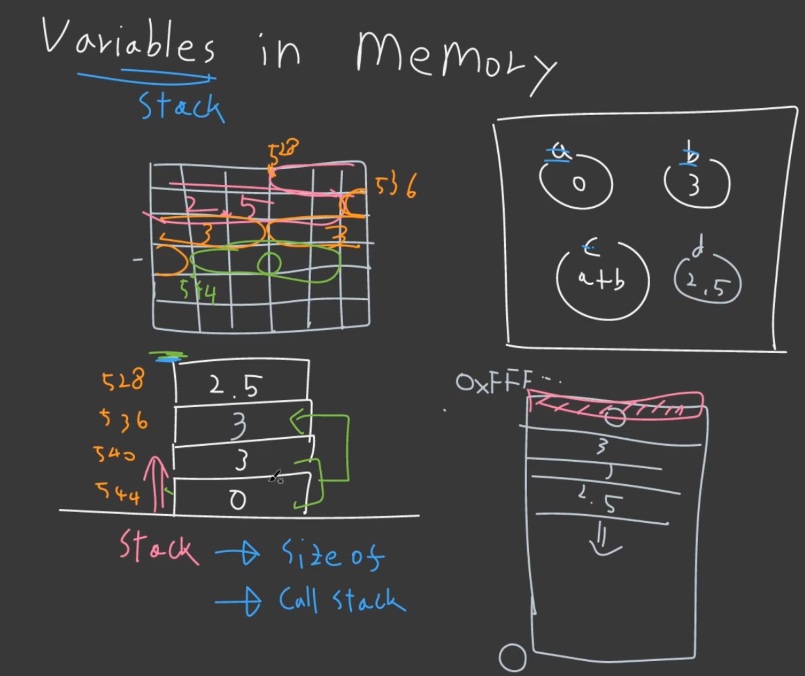
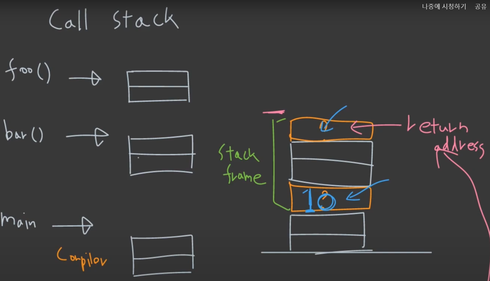
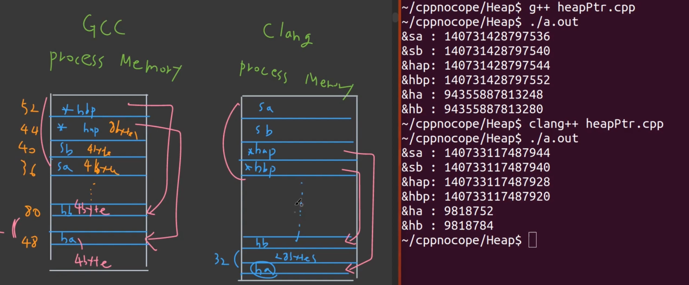

# 01 Memory Structure

## 1. Variables in Memory (Stack)
> 모든 건 memory space에서 어떻게 돌아가는지 상상.

### Stack Memory

```cpp
int main()
{
  int a,b,c;
  double d;

  return 0;
}
```
위 코드를 memory space에서 보면 다음과 같다.


---



- (top 기준) stack은 top에서 부터 address가 증가하는 방향으로 진행된다. 
- (첫 변수 기준) 처음 할당된 애 기준으로는 address가 감소하는 방향으로 진행된다.
- computer는 변수명을 들고 있지 않고, top에서 부터 몇번째에 위치하는지만을 이해한다.
- unix 기반의 clang, gcc compiler의 경우 memory는 top에서 부터 하나씩 내려오는 방향으로 진행된다.

> 위에 말들이 조금 헷갈릴 수 있지만, 그림을 기억하면 된다.

---
### Variable Types 1 (sizeof)

- Type Size in Memory

```cpp
{
	int a=0;
	std::cout << sizeof(int) << std::endl; // int: 4bytes => 32bits
	std::cout << sizeof(a) << std::endl;
	// integer: short(2), int(4), long(8)
	// float: float(4), double(8)

	static_assert(sizeof(int)!=4, "int is 4bytes") 
  // 위와 같이 int가 환경에 따라 4byte가 맞는지 확인할 수 있다.
	// 또는 int8_t, int16_t, int32_t, int64_t 등을 사용할 수 있다. 습관 들이면 좋을 듯

	//array
	std:array<int,5> b; // 20 byte
	
	return 0;
}
```

---
```cpp
#include <array>
#include <cstdint>
#include <iostream>

int main()
{
	uint64_t ui8;
	float f4;
	std::arrray<uint8_t,5> uia5;

	uint64_t *ui64ptr = &ui8;
	std::cout << sizeof(ui64ptr) << std::endl; //8
	std::cout << (uint64_t)ui64ptr << std::endl; //address
	
	return 0;
}
```

---
### Variables Type 2 (sizeof struct)
> 4 byte로 align 되므로 padding을 생각해서 struct 구성하기 (하드웨어 마다 다름)

```cpp
#include<iostream>

struct ST 
{
	long a; //8bytes
	int b; //4bytes
	short c; //2bytes
}

int main()
{
	std::cout << sizeof(ST) << std::endl; // not 14, 16 bytes
	
	return 0;
}
```

```cpp
#include<iostream>

class Cat
{
pulbic:
	void printCat(); //??? memory는 먹을까? ㄴㄴㄴㄴ
private:
	int age; // 4 bytes
	float weight; // 4 bytes
}

int main()
{
	std::cout << sizeof(Cat) << std::endl; // function은 class size와는 관계가 없다.
	Cat cat1; // 8 bytes
	Cat cat2; // 8 bytes

	Cat* catPtr = &cat1; // 8 bytes (64bit 기준)
	
	return 0;
}
```

- 정리
  - class에서 function은 메모리를 먹지 않는다.
  - pointer, struct, class도 전부 stack에서 메모리를 차지한다.
  - 변수를 선언하는 순서로 stack에 쌓이지 않는다. (stack frame)

---
### Call Stack & Stack Frame

```cpp
void foo()
{
	int a;
	int b;
}
void bar()
{
	Cat cat;
	Dog dog;
}

int main()
{
	int a;
	double b;

	foo();
	bar();

	return 0;
}
```

- 정리
  - stack memory는 변수대로 쌓이는게 아니라 function대로 결정되며 stack frame을 쌓는 식으로 결정된다. stack frame이란 하나의 function의 memory 조합?
  - function call에 의해서 결정, 즉 compiler가 결정한다.
  - stack frame = function + additional info. (argument, return address)



---
```cpp
class Cat
{
public:
	Cat()
	{
		m_age=1;
	};
	~Cat();
	void addAge(int arg)
	{
		m_age+=arg;
	};
private:
	int m_age;
};

int main()
{
	Cat cat;
	cat.addAge(10);
}
```

- 정리
  - 함수가 호출되면, stack frame이 올라가고, stack frame 내에는 반환주소값, 매개변수값, 지역변수 등이 올라간다. 그리고 함수가 종료되면 stack frame이 사라진다.

---
## 2. Heap Memory
> c++: unmanaged language, memory leak -> memory fragmentation

### Stack vs. Heap

- Stack: 쌓여간다
  - stack frame 단위로 쌓여가고, computer는 top 기준으로 순서를 찾는다. 
  - pointer의 경우 address를 타고 이동
  - top만 control 하기 때문에 간단함
  - stack -> heap 접근

- Heap: 거미줄처럼 

```cpp
int main()
{
	int* ip; //stack의 pointer가 생김
	ip = new int; // heap 공간에 int size 만큼 할당하고, stack은 여기를 가리킴
	*ip = 100; // heap의 공간에 100을 할당
	delete; // deallocation

	return 0;
}
```

> stack과 heap 비교: https://phoenixnap.com/kb/stack-vs-heap#ftoc-heading-5

---
### Heap을 왜 사용하는가?

1. Variable Lifetime
  - pointer를 stack에 쌓아놓고 heap에 data를 저장함으로써 계속 관리가능

2. Large Size
  - stack에만 pointer를 쌓아놓고, heap에 엄청 큰 data를 만듦

3. Dynamic Allocation (Runtime)
  - stack frame은 compile time에 결정
  - stack은 그러하여 compile을 해야 object가 몇 개인지 몇 개의 변수를 사용하는지 알 수 있음
  - heap을 이용하면 runtime에 가능

---
### Heap Memory 사용 

1. ~~C style: 쓰지마라~~

```cpp
#include <stdlib.h>

class Cat
{
public:
	Cat()
	{
		std::cout<<"meow"<<std::endl;
	}
	~Cat()
	{
		std::cout<<"bye"<<std::endl;
	}
private:
	int mAge;
};

int main()
{
	//C style heap Cat
	Cat *catp = (Cat*)malloc(sizeof(Cat));
	free(catp);

	// C style heap Cat array
	Cat *catap = (Cat*)malloc(sizeof(Cat)*5);
	free(catap);
}
```

2. C++ Style: delete를 안하면, memory leak 발생

```cpp
#include <stdlib.h>

class Cat
{
public:
	Cat()
	{
		std::cout<<"meow"<<std::endl;
	}
	~Cat()
	{
		std::cout<<"bye"<<std::endl;
	}
private:
	int mAge;
};

int main()
{
	//C++ style heap Cat
	Cat *catp = new Cat;
	delete catp;

	// C++ style heap Cat array
	Cat *catap = new Cat[5];
	delete [] catap;
}
```

3. Safer C++

```cpp
#include <stdlib.h>
#include <memory>
#include <vector>

class Cat
{
public:
	Cat()
	{
		std::cout<<"meow"<<std::endl;
	}
	~Cat()
	{
		std::cout<<"bye"<<std::endl;
	}
private:
	int mAge;
};

int main()
{
	//C++ style heap Cat
	std::unique_ptr<Cat> catp = std::make_unique<Cat>;
	//delete catp;

	// C++ style heap Cat array
	std::vector<Cat> cats(5);
	//delete [] catap;
}
```

---
### Dynamic Allocation (Runtime)

```cpp
#include <stdlib.h>
#include <memory>
#include <vector>

class Cat
{
public:
	Cat()
	{
		std::cout<<"meow"<<std::endl;
	}
	~Cat()
	{
		std::cout<<"bye"<<std::endl;
	}
private:
	int mAge;
};

int main()
{
	std::cout<< "how many cats do u need?" << std::end;
	int catCount;
	std::cin >> catCount;

	std::vector<Cat> cats(catCount);

	return 0;
}
```

> 이전에는 저게 왜 안되는지 모르고, 매번 시간 낭비했던 경험이 있는데 이제 이해가 된다..

---
## 3. Heap in Process

### Memory Leak

``` cpp
#include <iostream>

int main()
{
	int allocCount=0;
	std::cout << "how many?" << std::endl;

	for (int i=0; i<allocCount; i++)
	{
		int *ip = new int[250]; //1KB
		std::cout << "mem" << std::flush;
		delete [] ip; // 이걸 안하면 memory leak 발생
	}

	return 0;
}
```

- 정리
  - Heap의 경우 또 다른 공간으로 표현을 했지만, 사실은 Stack Memory가 쌓이는 공간 속에 pointer를 이용하여 하단을 가리키고 있다고 생각하는게 맞다.
  - 또한, Stack은 순차적으로 Memory가 Allocation 되지만, Heap의 경우 그렇지 않고, Memory Allocator 마음대로 정해진다.
  - Compiler에 따라 stack에 순서, heap memory의 위치 또한 다르다.



---
### Memory Leak Checking Tool

tool이 있지만, linux 환경이다. **Valgrind**

---
## 4. Heap, Stack, Static

- 복습
  - __Stack__
    - stack frame 단위로 allocation/deallocation
    - top에서 allocation/deallocation
    - fast
    - stack overflow 발생 가능
  - __Heap__
    - runtime에 비어있는 memory 공간을 찾고, 얼마나 allocation 할지 결정
    - multi-thread programming시 heap memory에 대한 접근 권한을 가지게 되는데, race condition을 없애기 위해 더 복잡한 방법으로 allocation/deallocation을 진행
    - slow
    - dynamic allocation 가능 
    - runtime에 결정, flexible
    - large size

---
### Memory Size에 따른 Stack, Heap 결정

```cpp
#include <array>

int main()
{
	//stack
	std::array<int,300> a; //1.2KB (stack)

	// 100KB 이상 또는 몇 MB 부터는 Heap을 사용하는게 맞다.
	std::vector<int> b(500000); //2MB (heap)

	int count;
	std::cin << count;
	// 이 경우 stack을 사용할 수 없으므로, heap=>vector를 사용한다.
	std::vector<Cat> dynamicCats(500);
}
```

- 정리
  - 100KB 이상 또는 몇 MB: 
    - Heap
  - 이하면: 
    - Stack

---
### 실제 Stack, Heap을 사용하는 상황 (Performance 입장에서)

```cpp
#include <array>
#include <vector>

void foo(int num)
{
	std::vector<Cat> cats(num);

	// do some computation over cats
};

void bar(int num) // allocation, disallocation 시간도 아까울 때, array로 선언
{
	if(num>1000) return false;
	std::array<Cat,1000> Cats;
	
	// do some computation over cats
};

int main()
{
	int count;
	std::cin << count;
	// 이 경우 stack을 사용할 수 없으므로, heap=>vector를 사용한다.
	foo(count);

	// what if we need performance critical cats?
	for(int i=0; i<10000; i++)
	{
		bar(i);
	}

	//std::array (stack array)
	//std::vector (heap array) STL
}
```

- 정리
  - 작으면 array
  - 크면 vector
  - 또는 dynamic allocation이면 vector

---
### Static (Global)

- Stack
- Heap
- Static
순으로 쌓여있다. (상단이 주소 값이 높고, 하단이 주소 값이 낮다)

```cpp
#include <iostream>

int ga=0; // static (global)

int main()
{
	int sa=0; //stack
	
	std::unique_ptr<int> hap = make_unique<int>; //heap
}
```

---
## 5. Object Creation

```cpp
class Person
{
public:
	Person(std::string name, int age)
		:name(std::move(name)), age(age){};
private:
	std::string name;
	int age;
};

int main()
{
	Person a("nocope", 31); //Stack
	std::unique_ptr<Person> a = std::make_unique<Person>
	
	Person *ap = new Person(); //Heap 
}
```

- __L-value__: copy, callable, T&
- __R-value__: move, temp, T&&

> 뒤 파트에서 설명 추가할 예정

*[HTML]: HyperText Markup Language
*[CSS]: Cascading Style Sheets
*[JS]: JavaScript
