# 02 Compile Process
> 어떻게 실행되는가.

## 1. C++ Build Process
> Source Code가 Compile 되어 Binary Code로 바뀌고, Computer는 그걸 읽어서 Program을 실행

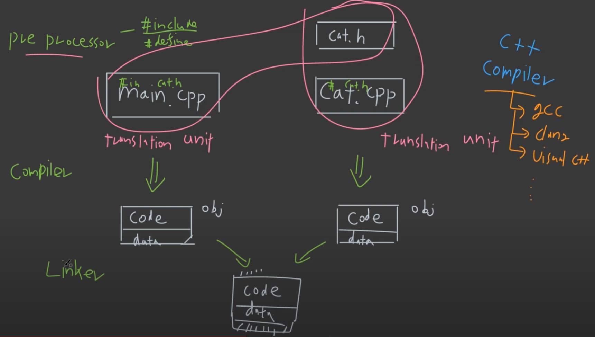

- __Build Process__
1. __Preprocessor__: _#include, #define_ 등과 같은 keyword를 찾아서 해당 header를 copy하여 __translation unit__ 으로 만들어준다.
2. __Compiler__: translation unit을 machine code와 global 변수의 initialization value들이 data 형식으로 들어간 __.obj file__ 로 만든다.
3. __Linker__: obj file들을 모아서 code와 data, 파일을 실행하기 위한 additional info.가 들어가 있는 __exe file__ 을 만든다.
4. 실행하면 Process Memory에 올라감.

---
## 2. Header, CPP (.h, .cpp)

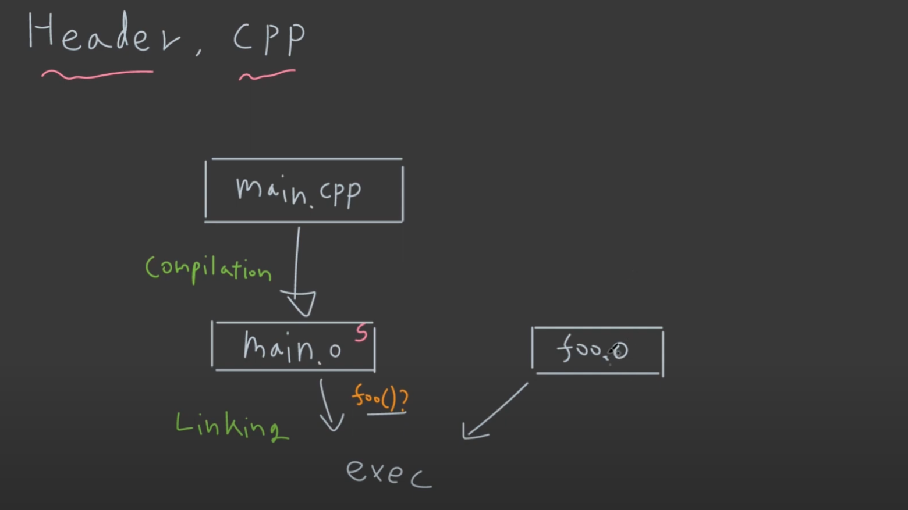

- 위와 같이, main.o도 뽑고, foo.o도 뽑은 후 linking을 같이 해줘야 실행된다.
- g++ main.cpp -c __(main.o 생성)__
- g++ foo.cpp -c __(foo.o 생성)__
- g++ main.o foo.o foo __(foo 실행파일 생성)__

---
### header

- declaration이 중복될 수 있기 떄문에, header를 따로 만든다.

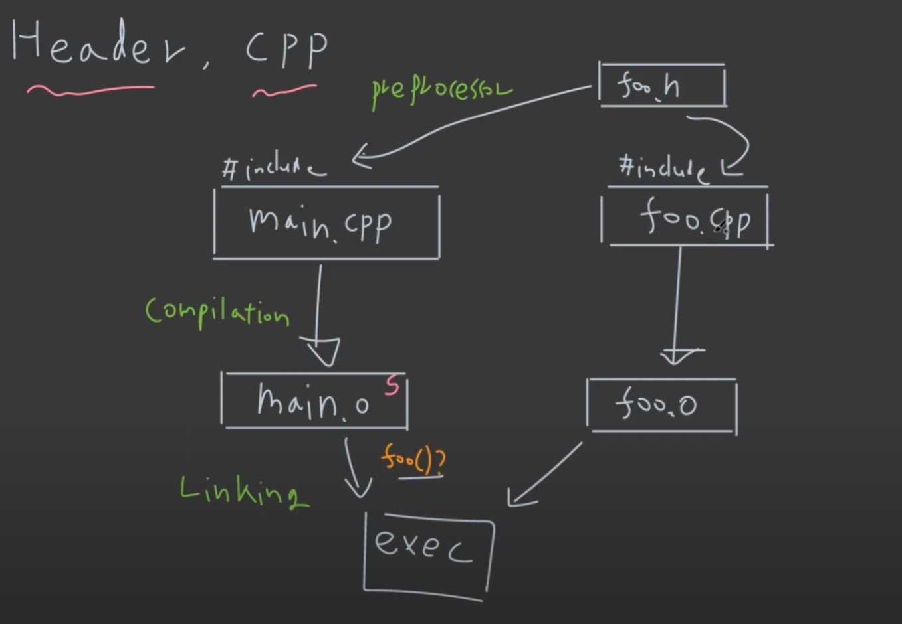

---
- class의 경우

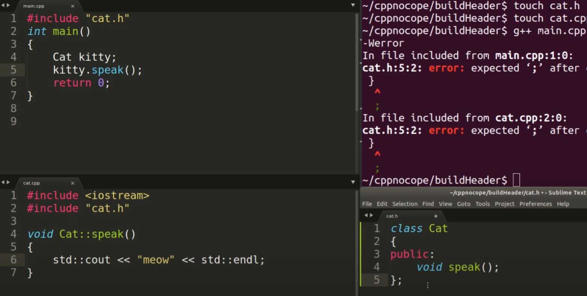

---
### OOP (Object Oriented Programming)

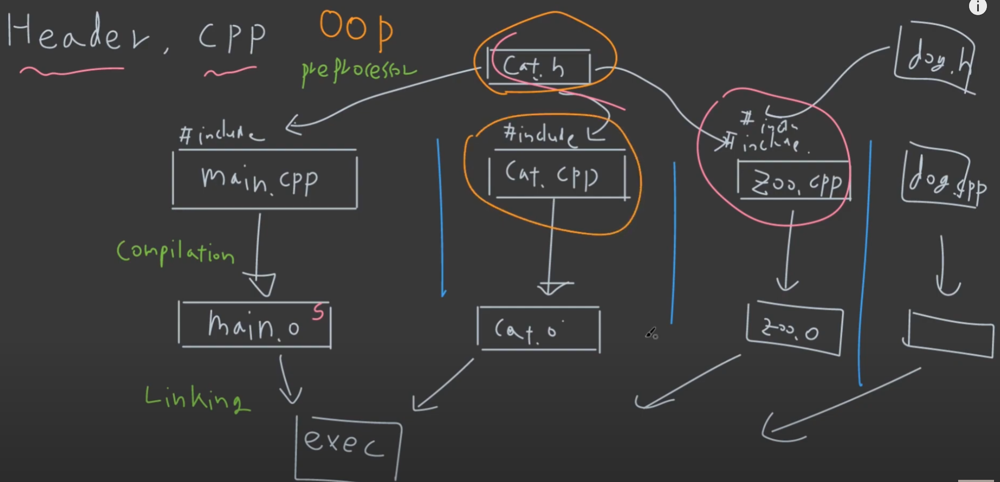

- 복잡해져도 object를 중심으로 header에는 declaration
- cpp에는 implementation을 관리하여 필요한 header를 preprocessor가 include함으로써 원하는 object 파일을 생성할 수 있다.

---
## 3. Preprocessor

### Conditional Inclusion

```cpp
#define ABCD 2
#include <iostream>

int main()
{
#ifdef ABCD
    std::cout << "1: yes\n";
#else
    std::cout << "1: no\n";
#endif
#ifndef ABCD
    std::cout << "2: no1\n";
#elif ABCD == 2
    std::cout << "2: yes\n";
#else
    std::cout << "2: no2\n";
#endif
}
```

---
### Replacing Text Macros 

```cpp
#define MAX_UINT16 65535
#define MAX(a,b) ((a)>(b)?(a):(b))
#include <iostream>

int main()
{
    std::cout << MAX_UINT16 << std::endl;
    std::cout << MAX(10,100) << std::endl;
    return 0;
}
```

- modern c++에서는 #define 을 최소화하는게 좋다.
- __아래와 같이 쓰는걸 습관화 하자.__

---
```cpp
#define MAX_UINT16 65535
#include <iostream>
#include <limits>

int main()
{
    std::cout<<std::numeric_limits<uint16_t>::max()<<std::endl;
    return 0;
}
```

- MAX 함수 또한 define 보다는 STL을 사용하자.

---
```cpp
#include<algorithm>

int main()
{
	std::cout<<std::max(10,100)<<std::endl;
}
```

- 또한, #define ABCD 2 이런 것도 c++ 17에서 부터 __constexpr int ABCD = 2__ 로 전역에 선언하면 된다. (추후에 설명함)

```cpp
#include<iostream>
constexpr int ABCD =2; //#define ABCD =2

int main()
{
	if constexpr(ABCD)	std::cout<<"1:yes\n";
	else std::cout<< "1: no\n";
	
}
```

---
### Predefined Macros

file 이름, line, date 등

_#include_ 는 cpp에 일반적으로 넣고 필요할 때만 header에도 넣는다.

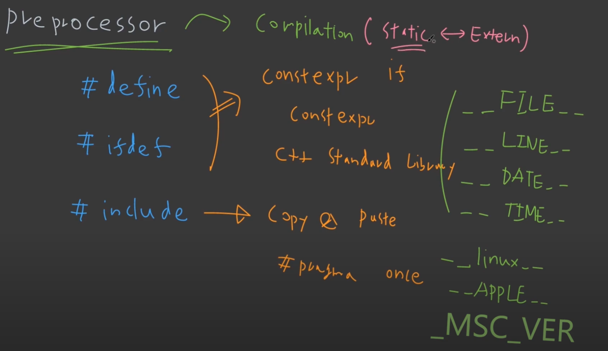


---
## Extern, Static

- _extern_: 바깥에서 찾아라
- _static_: 내부에서 찾아라

### Example

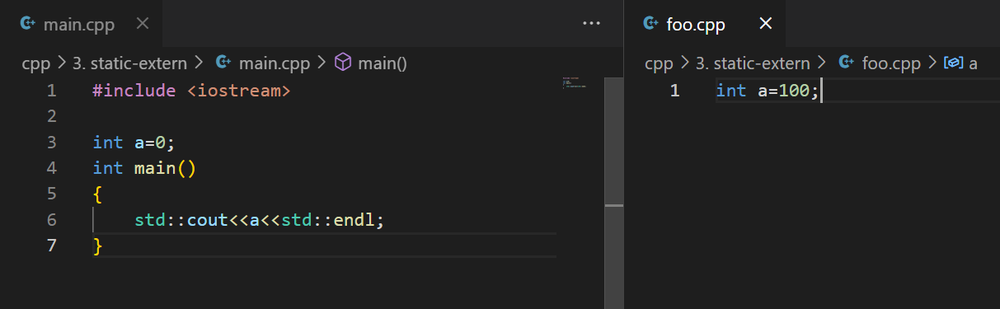

- 위의 경우 __g++ main.cpp foo.cpp__ 했을 때 오류가 발생
- 각각의 cpp가 obejct 파일까지 compile은 가능하지만, link 과정에서 오류가 생긴다.

---
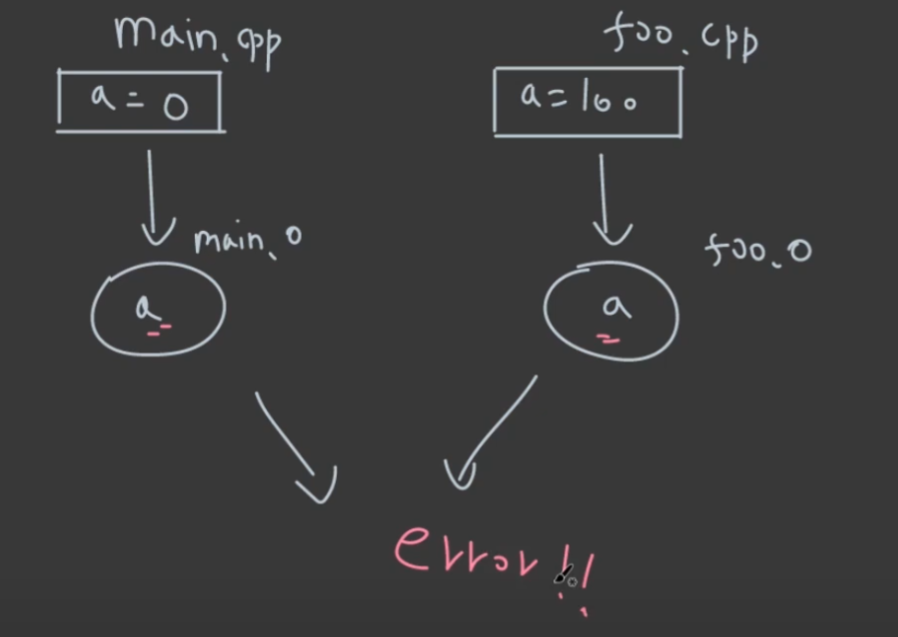

- 해결하려면 extern을 사용하자
> 이 경험도 이전에 많았다.. 계속 또 선언한다고 경고 계속 나왔었다..

---
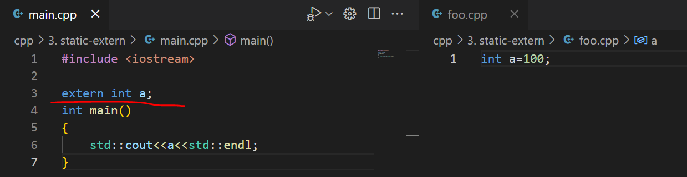
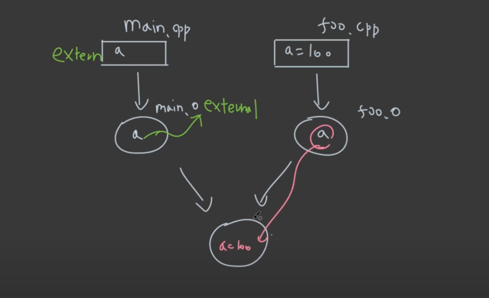

- 위와 다르게 main.cpp에서 a를 extern으로 선언하고 값을 주지 않았다. 이때 의미는 바깥쪽 어딘가 있으니 찾아라는 말이다.
- 즉 결과는 100이 나온다.

---
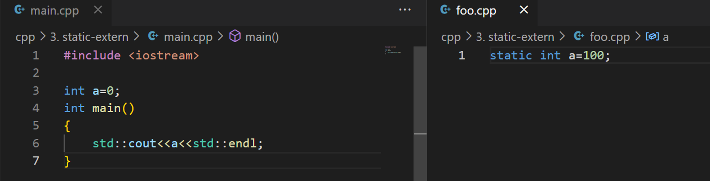
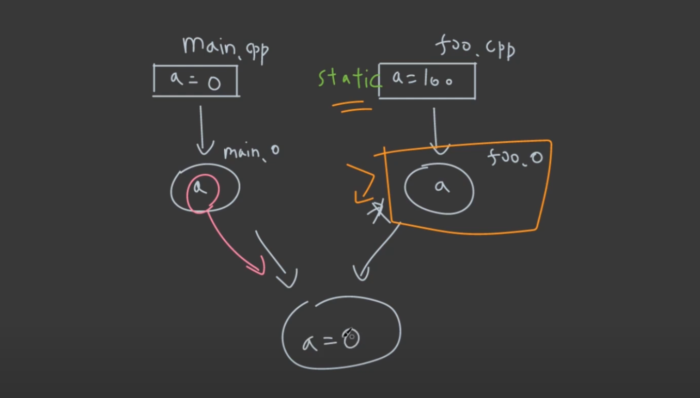

- 이번에는 main.cpp는 그냥 선언하고, foo.cpp에서 static을 이용해서 선언했다.
- 이건 의미가
	- static이란, 이 object 파일을 compile 할 때, 이 a라는 변수를 바깥에서 찾을 수 없게 만드는 기능이다. __하나의 translation unit or object file 안에서만 접근 가능하게 하는 keyword 이다.__

---
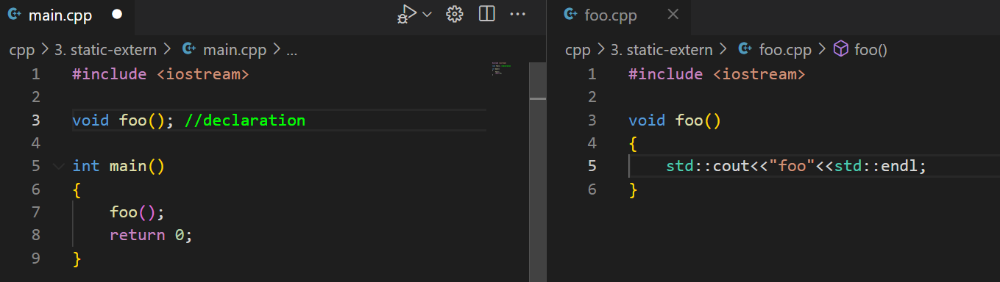

- function도 동일하게 동작한다.
- 위의 경우 foo라는 함수를 main.cpp에서 declaration만 하고 implementation은 없어서 link 과정에서 foo.obj를 들고와서 실행하는데, 이는 마치 extern keyword를 사용한 것과 같다. __그래서 함수에 대해서 default가 extern 값이 붙어있다.__

- 정리
	- __extern 과 static은 build를 안전하게 하기 위한 수단이다.__

---
### Name Mangling
> function overloading을 구분하기 위해서

```cpp
foo(int a) //Z3fooi
bar(double b) //Z3bard
```

- 위는 예시이고, compiler에 따라 달라진다.

---
### extern "C"

```cpp
extern "C" int foo(double a)
{
	return static_cast<int>(a);
}
```

- C++에서는 function overloading을 지원하지만, C에서는 지원을 하지 않기 때문에 name mangling 또한 지원하지 않는다.
- __C interface를 가진 binary를 제공하려면 mangling 기능을 다 지워야하므로 extern "C"를 쓴다.__


---
5. Library

- __header only__
	- header를 include 하는 것
- __static library__
	- 확장자 .lib, .a
	- build process에서 library를 가져와 link 해주는 것
- __dynamic library__
	- 확장자 .dll
	- load time, run time에 binding 할 수 있음.
		- load time은 program이 실행되고, loader가 process를 실행시킬 때 같이 dll을 가져와 실행
		- run time은 실행 중간에 dll을 가져와서 실행

---
### Static Library

_cpp -> compile -> object -> __link__ -> exe_
- link time에 binding 됨

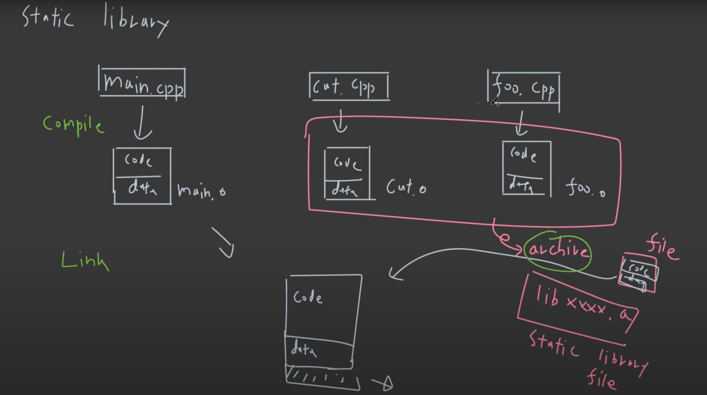

- 위의 경우 main.cpp를 제외한 나머지 2개의 object file을 library로 만들어놓고, linker가 들고와서 exe file을 만든다.

---
### Dynamic Library
_cpp -> compile -> object -> link -> __exe__._
- load, run time에 binding 됨

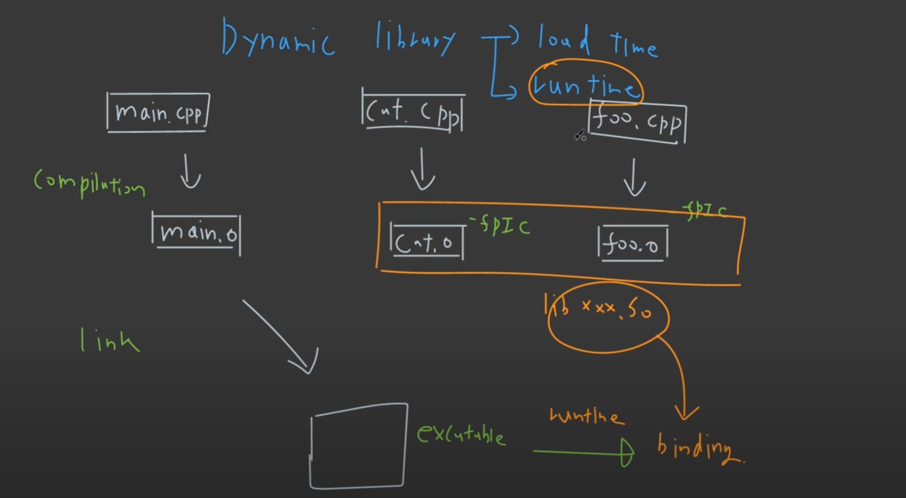

- shared library의 경우 실행파일을 만들 때, object의 내용이 아닌 symbol이 들어가며, load time에 binding 된다.
- 즉, static의 경우 전체 data를 넣어서 library로 만들고 그걸 이용해서 linker가 exe를 만들지만,
- dynamic의 경우 내용이 아닌 symbol만 넣어놓고, load, run time 때 binding 해서 들고온다.

*[HTML]: HyperText Markup Language
*[CSS]: Cascading Style Sheets
*[JS]: JavaScript
