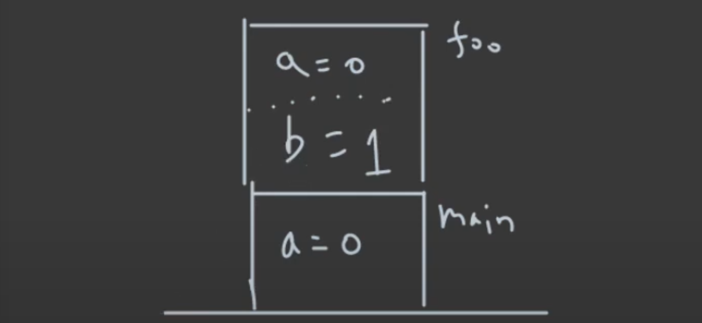
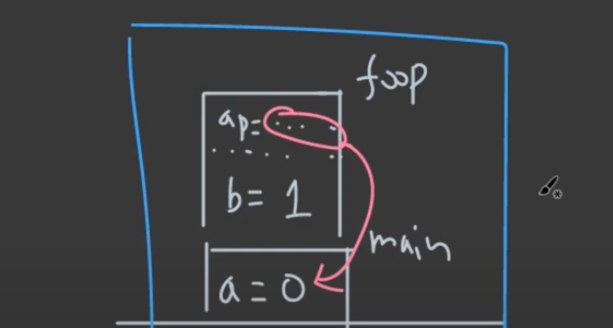
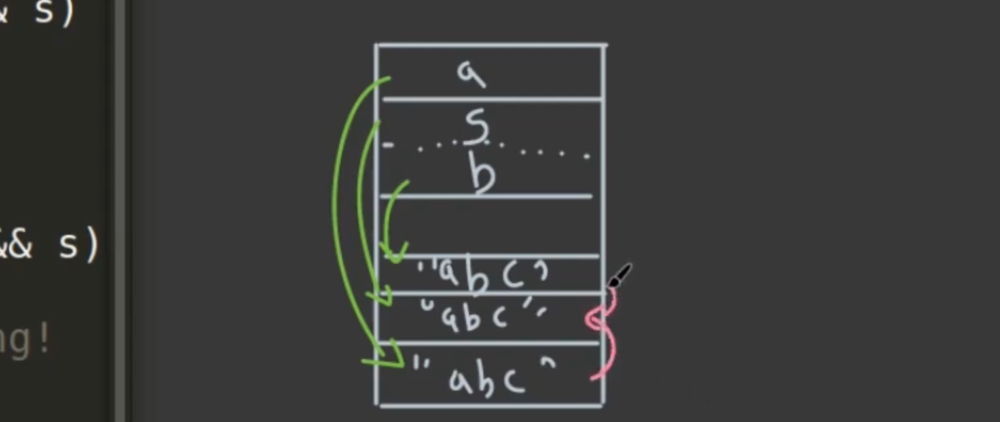
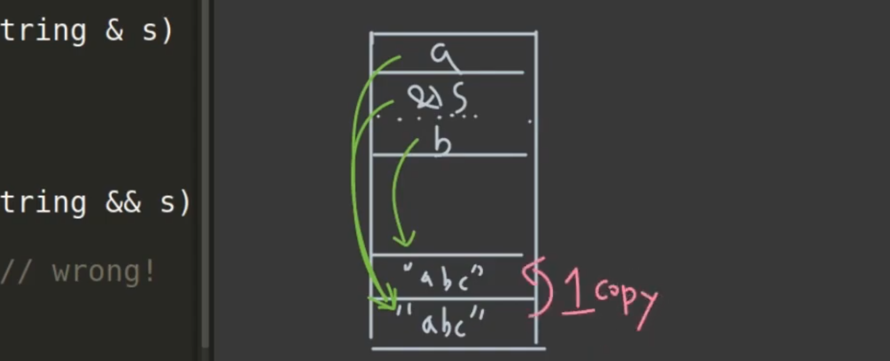
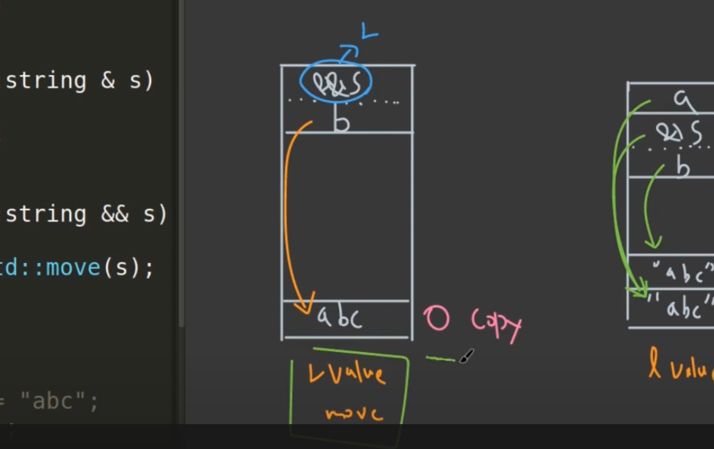
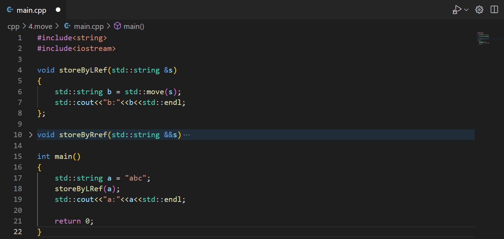
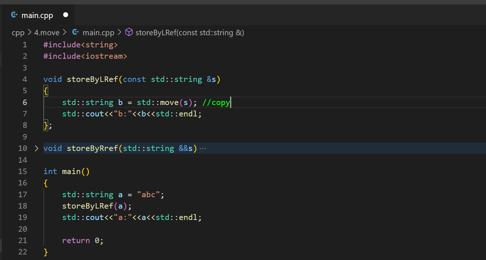
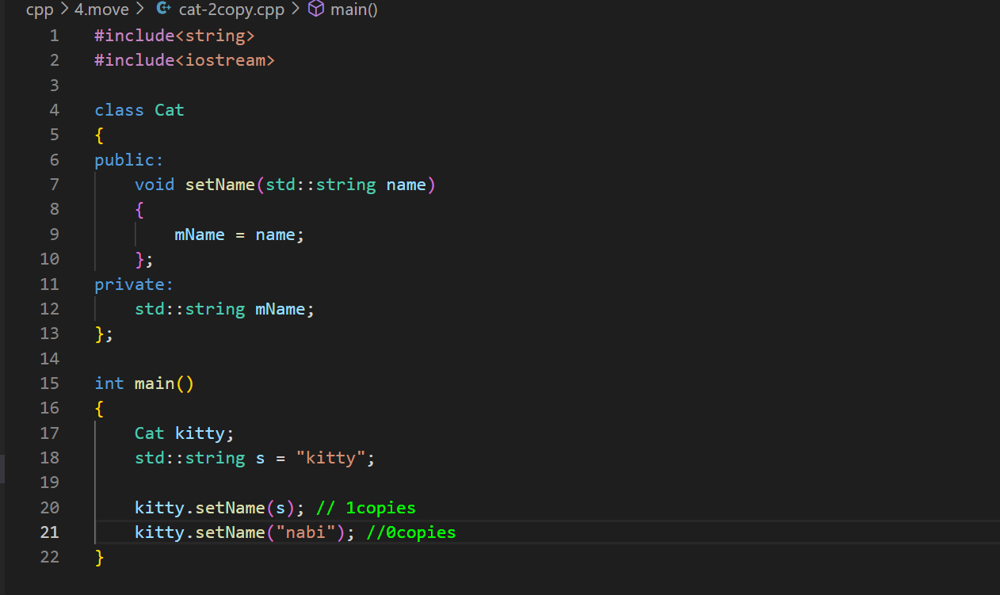
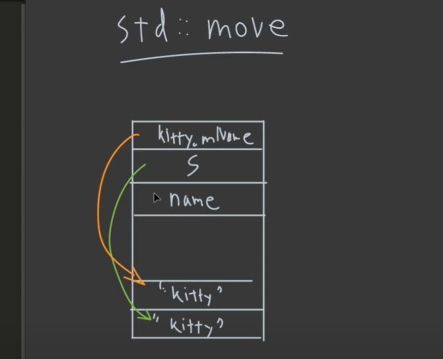
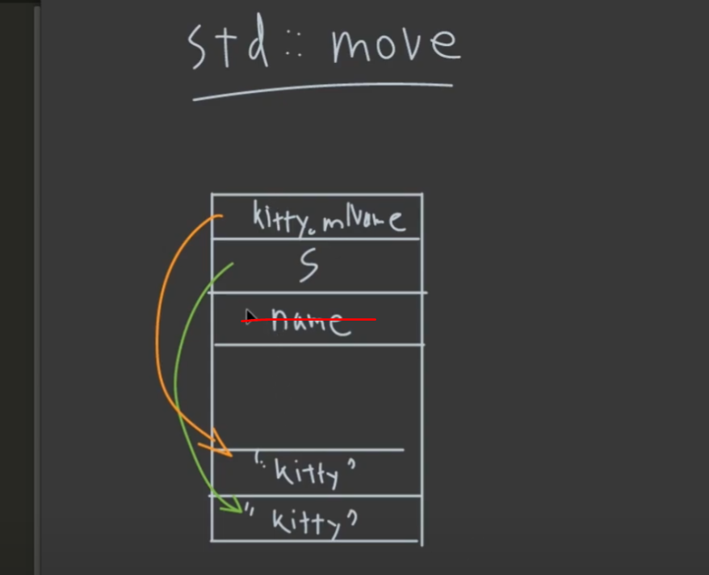

# 03 Resource Move
> 최대한 copy가 적게.

## pointer vs. reference 
- pass by value
- pass by pointer
- pass by reference

> 추억이다.

---
### pass by value

```cpp
void foo(int a)
{
	int b=a+1;
}

int main()
{
	int a=0;
	foo(a);
	
	return 0;
}
```



---
### pass by ptr & pass by reference

```cpp
void foo(int* a)
{
	int b= *a + 1;
}

int main()
{
	int a=0;
	foo(&a);
	
	return 0;
}
```

- a 의 주소를 __복사하여__ 넣어주고 사용, 해당 ptr은 __main stack frame__ 의 a의 접근할 수 있다.

---
```cpp
void foo(int& a)
{
	int b= a + 1;
}

int main()
{
	int a=0;
	foo(a);
	
	return 0;
}
```

- pointer와 당연히 동일, 어셈블리가 같기 때문



---
### 뭐가 제일 좋은가?

- reference와 pointer는 동일하지만, pointer를 노출시키면 bug의 위험이 있어 pass by reference를 쓰면 된다고 한다.

- __TIP__
	- const를 일단 붙여라
	- std::array<int,100>과 같은 변수를 인자로 넘겨주면 전부 stack에 복사가 되므로 감당히 힘들다. 이럴 때는 당연히 pointer를 이용해서 넘겨줘야 한다.


## 2. L-value, R-value

### Definition

```cpp
int a=0; // equal 좌항에 존재하면 L-value, 우항이면 R-value
int b=a; // 이 경우 둘다 L-value
```

- 한번 부르고 다시 부를 수 있으면: __L-value__
- 한번만 부르고 끝이면: __R-value__

---
### std::move()

```cpp
int c = std::move(a) // 좌항은 L-value, std::move를 쓰면 R-value
```
- std::move()는 L-value를 R-Value로 변경
- 왜 쓰는가? 추후 설명

---
### Example - Store By Value/L-Ref/R-Ref

```cpp
#include <string>

void storebyValue(std::string s)
{
	std::string b = s;
}

void storeByLRef(std::string &s)
{
	std::string b = s;
}

void storeByRef(std::string && s)
{
	//std::string b = s; //wrong
	std::string b = std::move(s)
}

int main()
{
	std::string a="abc";
	storebyVlaue(a);
	storebyLRef(a);
	//storebyRRef(a); /wrong 
	//storebyRRef(std::move("a")); 
	storebyRRef("abc");
}
```

---
### _storeByValue_



1. _std::string a = "abc";_
2. stack에 _a_, heap에 _"abc"_ 할당
3. _storeByValue_ 의 stackframe이 오고,
4. _argument:_ _string s_ 와 _"abc"_ 각각 stack과 heap에 복사
5. _local variable:_ _string b_ 와 _"abc"_ 각각 stack과 heap에 복사
> 이젠 머릿속으로 stack, heap, stack frame 자동 그리기

- __2 copy__

---
### _storeByLRef_



1. _storeByLRef_ 의 stackframe이 들어오고,
2. 이번에는 _s_ 는 _"abc"_ 값이 heap에 복사되는게 아니고,
3. stack에만 _s_ 가 생기고 바로 _a_ 가 가리키고있는 "abc"를 가리킴 
4. _b_ 는 둘 다 복사

- __1 copy__

---
### _storeByRef_



1. _storeByRef("abc");_ 는 저장을 해두는게 아니라 임시로 존재하기 때문에 heap에는 "abc"가 존재하지만, stack에는 임시로 설정되어 있음.
2. 함수가 call이 오고 _storeByRef_의 stackframe이 쌓임.
3. argument인 _std::string &&s_ 가 heap에 _"abc"_ 를 바로 가리킴.
4. 그냥 _std::string b = s;_ 를 하면 복사가 되지만,
5. _std::move(s)_ 를 사용하면, 임시로 설정된 _s_ 가 가리키는 _"abc"_ 의 소유권을 뺐은 후 local variable _std::string b_ 가 heap에 있는 "abc"를 가지게 됨.

- 정리
	- 함수에 들어오고나서는 _s_ 가 이제 L-value로 바뀌는데 이때 한번 더 쓰면 copy가 발생하므로 _std::move()_ 를 이용해서 그대로 연결시켜주는 느낌으로 이해하면 됨.
	- __즉, 한번도 copy가 일어나지 않음.__
	- _std::move()_ 는 소유권을 뺐음. heap에 존재하는 data를 가져간다 라고 생각하면 될 듯
	- __R-value reference를 이용하면 _std::move()_ 를 내부에서 써준다고 생각__

- __0 copy__

---
## 3. _std::move()_

### Resource Ownership

```cpp
#include<iostream>
#include<string>

int main()
{
	std::string a = "nocodeprogram";
	std::cout<<"a:"<<a<<std::endl;

	std::string b = std::move(a);
	std::cout<<"b:"<<b<<std::endl;
	std::cout<<"a:"<<a<<std::endl;
}
```
> 실제 string model은 stack에서 heap을 가리키는 간단한 구조가 아니라고 해서 예제용으로만 생각하라고 하심.

- 결과는 마지막 _a_ 는 아무것도 출력하지 않는다.
- _std::move()_ 로 인해 __resource ownership__ 을 다른 애한테 뺐겼기 떄문이다.

---


- 위와 같은 _a_ 는 __resource ownership__ 을 _b_ 한테 넘겨준다.
- 결과는 _a_ 는 나오지 않고, _b_ 만 _"abc"_ 가 출력된다.

---


- __[주의]: 하지만 argument 앞에 _const_ 를 붙여주면 안에서의 _std::move()_ copy로 작동한다.__

---
### Copy Ellision Rule (복사 생략)
인수로 R-value가 임시적으로 잠깐 자리를 차지했다가 사라지는 경우는 어떻게 될까?



- __이럴 경우는 어떻게 되는지 다음과 같다.__

---


---


- copy ellision rule에 따라서, R-value가 인자로 들어갈 때, _name_ 에서 __1 copy__ 가 일어나야하는데,
	- computer가 R-value임을 알고 copy ellision이 일어나 _name_ 이 _"nabi"_ 를 가리킨다.

---
## 4. RVO (Return Value Optimization)


- __결론: 0 move, o copy가 발생__
- computer가 이미 function의 return address를 알고 있어서,
	- _getString()_ 내부의 _s_ 는 만들어지지 않고, 바로 가리킨다.

- _std::move()_ 형식으로 _return_ 을 할 필요는 없다고 한다.

*[HTML]: HyperText Markup Language
*[CSS]: Cascading Style Sheets
*[JS]: JavaScript
