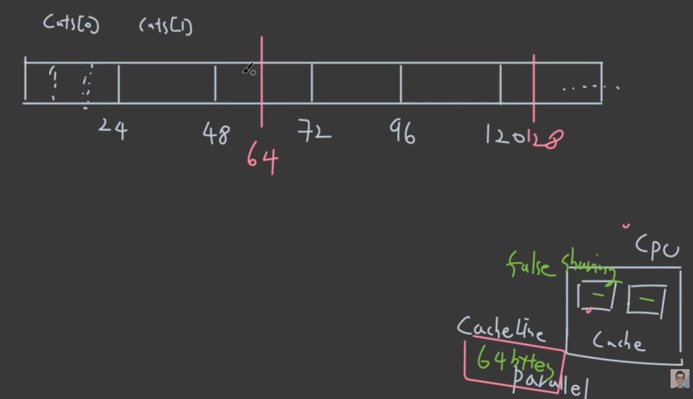
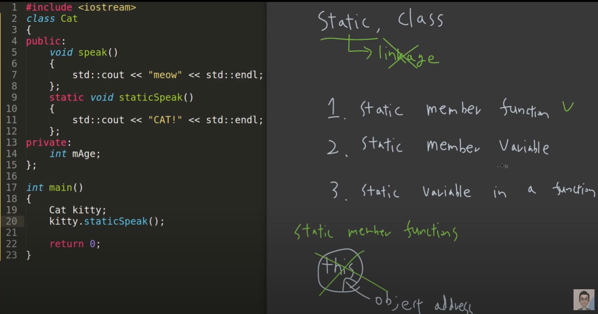
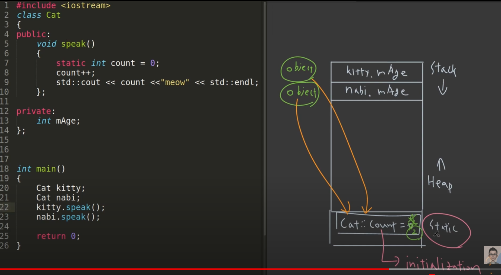
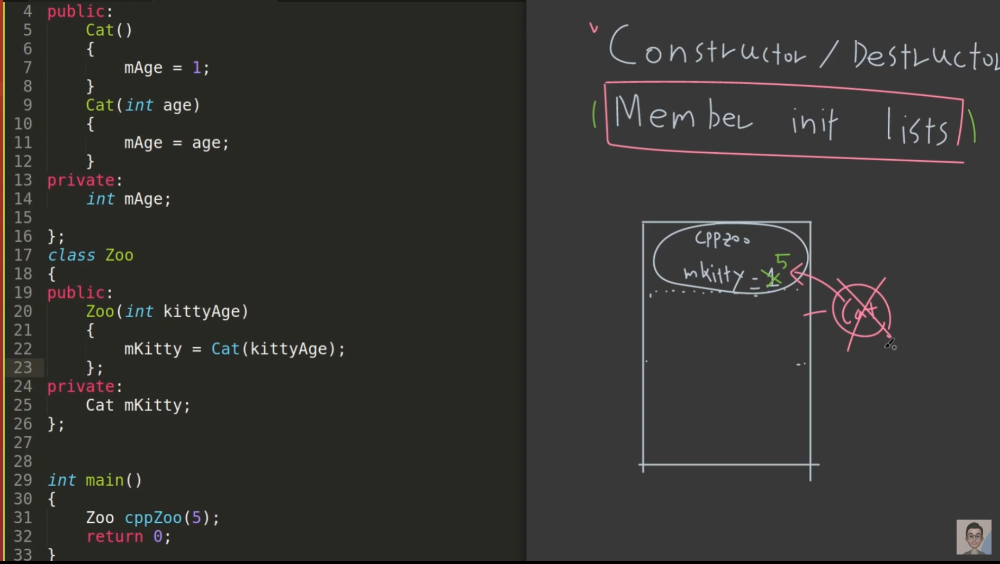
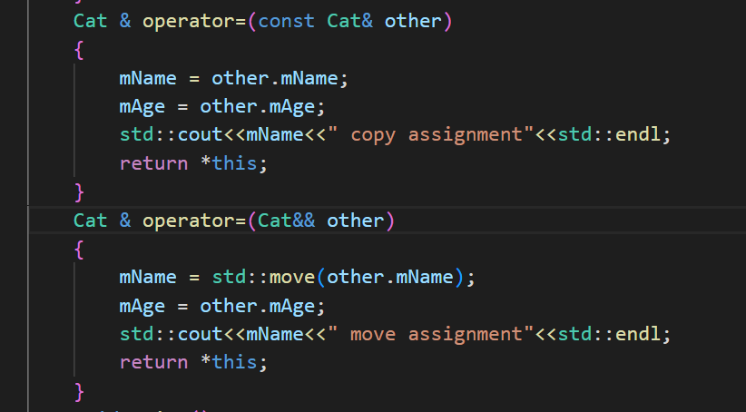
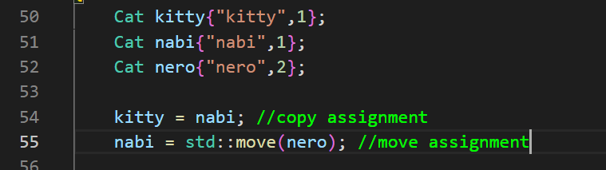
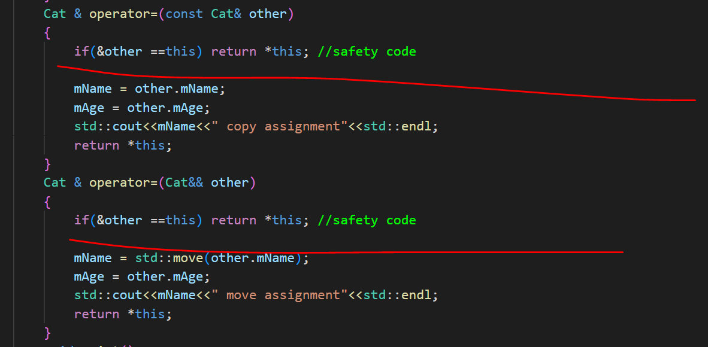
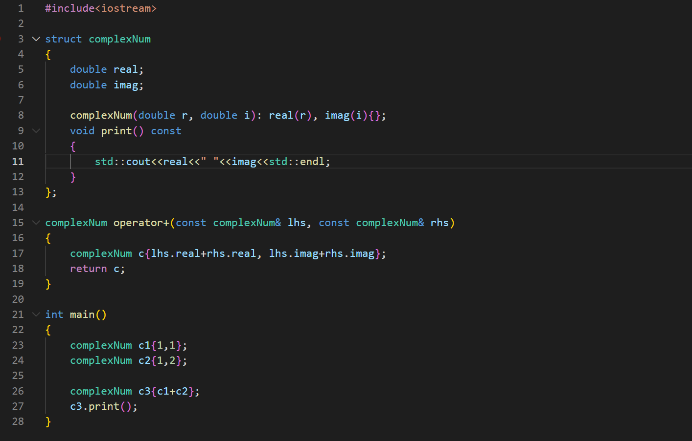
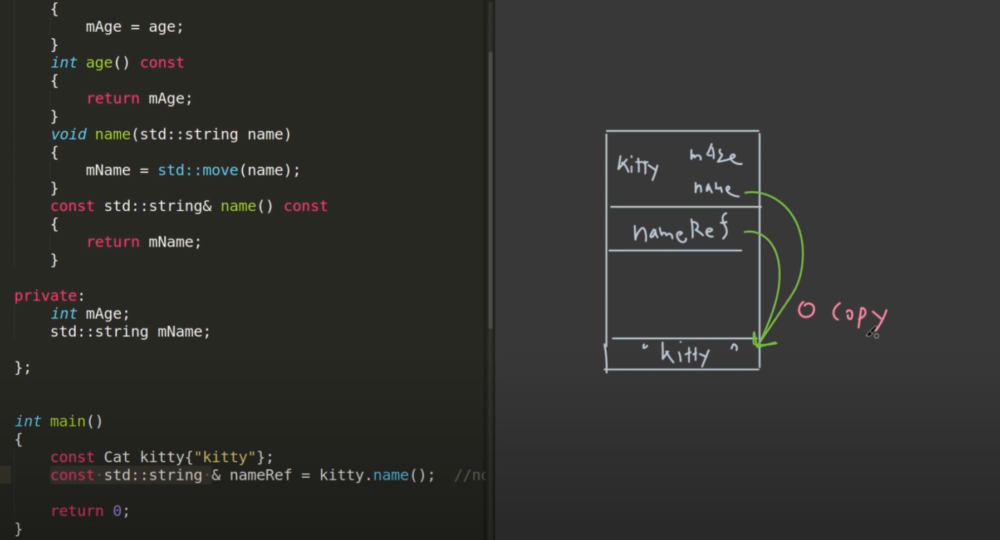

# 04 OOP (Object-Oriented Programming)
> OOP가 무엇인지 설명해보세요.

## 1. 기본 개념 
- object들을 중심으로 코드를 구성

	- __Abstraction__: 
		- 사실상 프로그래밍의 모든 것
		- 단순화, 재사용, 중복제거, 유연성, 유지보수를 목적
		- ex) 추상 클래스, 인터페이스
	- __Encapsulation__:
		- capsule화 해서 외부에서 데이터 접근을 막는 것
		- private
	- __Inheritance__:
		- 상속
	- __Polymorphism__:
		- static: function overloading
		- dynamic: function overriding

> 프로그래밍의 목적이 OOP이면 안된다. OOP는 활용하는 것이다. 이해하기 편한 코드를 만드는 것

---
## 2. Object Alignment

### Alignment (Padding)
object alignment rule에 의해 달리진다.

- __Rule 1__: member variable의 시작 위치는 type size의 배수에서 시작한다.
- __Rule 2__: 총 size는 가장 큰 type의 size 배수이어야 한다.

---
### False Sharing (Advanced)
- 가속화된 Parallel Programming에서는 대부분의 CPU는 여러 개의 Multi-Core로 구성
- Data Access 시간을 최소화하려고 Cache를 사용하고 가장 최소 단위인 Cache Line은 일반적으로 64 Bytes로 이루어짐.
- L1 Cache는 Core마다 가진다. 각각의 Core가 같은 공간에 접근하면 __False Sharing__ 이 발생한다.

> 하나의 Cache Line에 다른 정보값이라도 두 Core가 동시에 접근하면 __False Sharing__ 이 발생한다.



- __False Sharing__ 을 방지하려면?
	- _alignas(#)_ 을 사용하면 된다.
	- 아래의 경우 원래는 24bytes로 align 되지만, alignas를 통해 32bytes align되고, 이는 false sharing을 방지한다.

```cpp

class alignas(32) Cat
{
public:
	void speak();
private:
	char c1;
	int i4a;
	int i4b;
	double d8;
}
```

---
## 3. Static Member
> Link에서 static과는 다르다.

- Class에서 사용되는 Case들
1. static member function
2. static member variable
3. static variable in a function

---
### static member function (this X)



- static member function은 object와 연관이 있다.
- 이는 class의 this랑 연관이 있는데, 멤버함수는 전부 _this->_ 가 붙어있다.
- static member function은 this와 binding이 되지않아, object가 없어도 call이 될 수 있다.
- __즉, this (object address)가 없으므로, member variable 접근도 안된다.__
- object에서는 static member function call이 가능하다.

---
### static member variable (static 공간에 선언, global)



- Class Object들끼리 서로 공유하는 member variable 선언
- __static 공간에 저장__
- 멤버 변수로 따로 선언해도 되지만, 어떠한 한 함수에서만 사용하면, 
	- 함수 내부에서 _static int cnt = 0;_ 으로 선언하여 공유할 수도 있다.
	
---
## 4. Member Initalizer List

### Constructor, Destructor
- stack frame을 명확히 가지고 있는 함수
- argument 또한 가질 수 있다.

---
### Member Initializer List



- __문제 상황__
	- 일반적으로 _Zoo_ 라는 class에 _Cat mKitty_ 를 가지고 있고 _Zoo_ 의 생성자에서 _mKitty=Cat(kittyAge)_ 로 되면 기본적으로 _cppZoo_ 가 만들어질 때, 멤버변수 _Cat mKitty_ 한 마리와 생성자에서 _mKitty_ 를 초기화할 때, 임시 _Cat_ 한 마리가 불필요하게 생성된다.

```cpp
public:
	Zoo(int kittyAge)
	{
		mKitty = Cat(kittyAge);
	};
```

- __해결__
	- Member Initializer List를 사용하자.

```cpp
class Zoo
{
public:
	Zoo(int kittyAge):mKitty(kittyAge){};
private:
	Cat mKitty;
};
```

__즉 Class 내부에 초기화는 가능하다면 최대한 member initializer list를 사용해 불필요한 생성을 막자__

## 5. Copy/Move Constructor/Assignment

- 일반적으로 다음 4가지의 함수는 Class에서 자동 생성된다.
	- Constructor, default
	- Destructor
	- Copy/Move Constructor
	- Copy/Move Assignment

- 또한 pointer를 사용하면 사용자가 직접 정의해야한다.
	- __Rule of Three__
	- __Rule of Five__
> https://blog.hcmc.studio/58

---
### Copy Constructor

```cpp
Cat(const Cat& other):mName{other.mName},mAge{other.mAge}
{
	std::cout<<~~~~
}

int main()
{
	Cat kitty{"kitty",1};

	Cat kitty2{kitty}; // Copy Constructor
	Cat kitty3 = kitty; // Copy Constructor, not assignment
}
```

- 위에서 보듯이 _Cat kitty3 = kitty_ 를 할당으로 착각하면 안된다.
- const, reference를 사용해주고, member initializer list로 사용하였다.

---
### Move Constructor

```cpp
Cat(Cat&& other): mName{std::move(other.mName)}, mAge{other.mAge}
{
	std::cout<<"move"<<std::endl;
}

int main()
{
	Cat kitty{"kitty",1};

	Cat kitty2{std::move(kitty)};
}
```

- _kitty_ 미리 생성 후, 소유권을 없앤 뒤 넣어줘서, R-Value Reference를 사용하고 있다.
- 그에 따른 _std::move() 사용_

---
### Copy Assignment

- 일단 Constructor와 차이는 이미 선언이 된 두 Object 사이의 연산이 Assignment이다.
	- 그러면 위의 _Cat kitty3 = kitty_ 이것이 왜 할당이 아닌지 이해가 될 것이다.
- Copy Assignment는 이미 선언된 Object의 정보를 내 것으로 __copy__ 하는 것이다.




- 여기서 조심해야하는 점은, Move Constructor/Assignment를 사용할 때,
	- argument에 _const_ 를 붙이면 __copy__ 가 일어난다.
	- 본 목적은 __resource ownership__ 을 주는 것이므로 _const_ 를 쓰지 말자.

---
### Safety Code



- 자기 자신을 할당하려고 하면 이러한 코드로 막아주자

```cpp
	if(&other==this) return *this; //safety code
```

---
### noexcept

constructor 이외의 함수는 필요한 새로운 resource를 요청 안하기 때문에 exception이 필요없어 noexcept를 해줘야 한다. __(advanced)__

> 위의 내용들은 사실 Pointer를 사용하지 않는 이상 필요없다.

---
## 6. Function, Operator Overloading

### name mangling (static polymorphism)
- 복습
	- 어떠한 함수가 binding 될지는 Compile 시간에 결정된다.
	- dynamic polymorphism (runtime): using _virtual_

---
### Operator Overloading



---
### Function 뒤에 붙는 _const_ 의 용도

이 함수 안에서는 어떤 변수도 바꿀 수 없음 (_mutable_ 은 예외)

---
## 7. Class Keywords

### _const_

__그냥 다 붙여라__

- member function이 member variable을 안 건드리면 다 붙여라
- compiler로 부터 error를 발견하게 할 수 있다.

---
### _mutable_

- _const_ 를 무시할 수 있다.
	- 가급적 쓰지마라. 쓰면 쓸수록 _const_ 의 의미가 사라진다.

---
### _explicit_

- implicit conversion 때문에 막기 위해 사용 (자신이 원하지 않는 형 변환을 막기 위해서)
- constructor에서 사용

```cpp
private: 
	int mAge;
\\\\\\\\\\\\\\\\\\\\

const Cat kitty=3;
```

- 위와 같이 해도 compiler가 알아서 argument로 인식하고 compile이 된다.
- 근데 이것을 막으려면 constructor 부분에 _explicit_ keyword를 넣으면 막아준다.
- 더 안전한 프로그램이 된다.

---
### constexpr
이전에 [_#define_ 대신 _constexpr_](2023-10-17-cpp-02-compile-process.md#replacing-text-macros). 을 쓰라고 했던 것 같다.

- 일단 _constexpr_ 이란?
	- _const_: compile time, run time에 둘다 생성할 수 있고
	- _constexpr_: compile time에만 생성할 수 있다.

- 그럼 왜 _#define_ 보다 _constexpr_ ?
	- type safety: type을 명시하지 않아 type 체크를 compiler가 따로 하지 않음.
	- 가독성 문제: 일반적인 변수와 구분 힘듦.
	- 디버깅 문제: 프로그램이 실행되기 전 preprocessor에 의해 처리되어 디버깅 어려움.

---
### static, friend, volatile, inline
> 일단 패스

---
### Encapsulation의 효율화



- class member variable을 _return_ 하는 함수에서
	- return by value를 하면 필요없는 copy가 발생하므로
	- _const_ 와 _&_ 를 붙여주자

- 즉, return by value를 할 경우 _return_ 할 value를 담을 하나의 stack에서의 임시 변수와 heap에도 동일하게 data를 복사하지만,

```cpp
const std::string& name() const
{
	return mName
}

int main()
{
	const std::string& nameRef = kitty.name(); // 0 copy
}
```

- 즉 _int_ 와 같이 크기가 작을 떄는 _return by value_ 도 상관없지만,
- 크기가 클 때는, _return by reference_ 를 통해 copy를 줄일 수 있다.
- _const_ 를 붙임으로써, _mName_ 의 수정을 막아주고, encapsule화 할 수 있다.

*[HTML]: HyperText Markup Language
*[CSS]: Cascading Style Sheets
*[JS]: JavaScript
