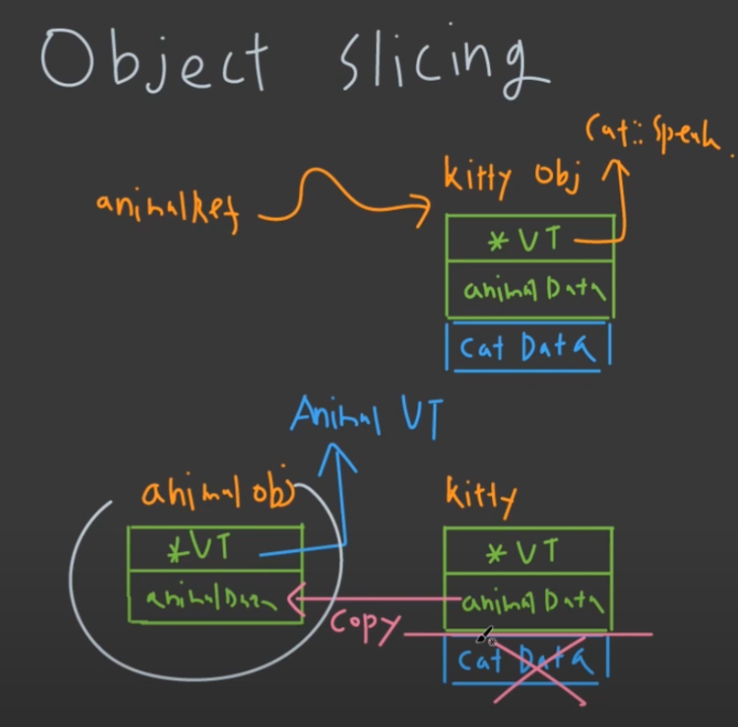

# 05 Inheritance
> 개인적으로 매번 봐도 헷갈리는 부분이 계속 있는 것 같다. 잘 정리해서 공부해보자.

## 1. Virtual Function

### Constructor/Destructor in Inheritance
- _Animal -> Cat_ 순서의 상속이 진행된다면, 다음과 같은 실행 순서를 가진다.
	- _Animal Cons._
	- _Cat Cons._
	- _Cat Des._
	- _Animal Des._

---
### 상속을 그래서 왜 쓰냐? => Dynamic Polymorphism

- __code__
```cpp
#include <iostream>

class Animal
{
public:
	Animal()
	{
		std::cout<< "animal cons\n";
	}
	~Animal()
	{
		std::cout<< "animal des\n";
	}	
};

class Cat: public Animal
{
public:
	Cat()
	{
		std::cout<< "cat cons\n";
	}
	~Cat()
	{
		std::cout<< "cat des\n";
	}	
};

int main()
{
	Animal* polycat = new Cat();
	delete polycat;
}
```

- __result__


- __분석__
	- 결과를 보면 _Cat_ Destructor가 실행되지 않았다.
	- _why?_: base class destructor가 _virtual_ (_public_ 또는 _protected_)로 선언되지 않았기 때문
	- 일반적으로
		- base class는 _virtual_ 을 붙여주고,
		- derive class는 상속을 받았다는 의미로서 _override_ 를 뒤에 붙여준다.

- __code__
```cpp
#include <iostream>

class Animal
{
public:
	virutal void speak()
	{
		std::cout<< "animal speaks\n";
	}
	virtual ~Animal()=default;	
};

class Cat: public Animal
{
public:
	void speak() override
	{
		std::cout<< "cat speaks\n";
	}
};

int main()
{
	int i=0;
	std::cin >> i;

	Animal* polyAnimal;
	if(i==1) polyAnimal = new Cat();
	else polyAnimal = new Animal();

	polyAnimal->speak();
	delete polyAnimal;
}
```

- 분석
	- 이와 같이 input에 따라, compile time이 아닌, run time 때, object가 결정될 수 있게 하는 것이 inheritance와 virtual keyword를 통해 할 수 있고,
	- 이를 __dynamic polymorphism__ 이라고 한다.

---
## 2. Virtual Table

### Address Info.
```cpp
#include <iostrema>
#include <array>
#include <memory>
#include <vector>

class Animal
{
public:
	virtual void speak()
	{
		std::cout<<"animal speaks \n";
	}
private:
	double height;
};

class Cat: public Animal
{
public:
	void speak() override
	{
		std::cout<< "cat speaks \n";
	}
private:
	double weight;
};

int main()
{
	std::cout<<"Animal size: "<<sizeof(Animal)<<"\n";
	std::cout<<"Cat size: "<<sizeof(Cat)<<"\n";

	return 0;
}
```

- __문제__
	- 위의 코드에서 _Animal_ 과 _Cat_ 의 Size는 각각 몇일까?

- __정답__
	- _Animal_ 은 8 Bytes, _Cat_ 은 16 Bytes를 들고 있다고 생각이 될 수 있지만,
	- _virtual_ keyword와 _override_ keyword를 사용해서 8 bytes 씩 추가가 된다.
		- 이 8 byte는 address 정보를 담는 pointer이고, virtual table을 가리킨다.

---
- __Example__

```cpp
#include <iostrema>
#include <array>
#include <memory>
#include <vector>

class Animal
{
public:
	virtual void speak()
	{
		std::cout<<"animal speaks \n";
	}
private:
	double height;
};

class Cat: public Animal
{
public:
	void speak() override
	{
		std::cout<< "cat speaks \n";
	}
private:
	double weight;
};

int main()
{
	Animal* polyAnimal = new Cat();
	polyAnimal->speak();
	delete polyAnimal;

	return 0;
}
```

- __분석__


- _Animal_ 로 만드냐, _Cat_ 으로 만드냐에 따라 해당 pointer는 _Animal_ Virtual Table을 가리키거나, _Cat_ Virtual Table을 가리켜 _speak()_ 함수가 다르게 나올 수 있는 것이다.

---
## 3. Pure Virtual Function, Abstract Class

```cpp
class Animal // abstract class
{
public:
	virtual void speak() = 0; // pure virtual function
}
```

- pure virtual function이 하나라도 있는 class를 abstract class라고 하고 해당 class는 object 생성이 불가하다.
	- 하지만 derive class는 가능하다.

- __즉, Base Class에서 pure virtual function을 선언하면 derive class에서는 반드시 해당 함수를 구현해야한다.__

---
### Example

```cpp
#include <iostream>
#include <array>
#include <memory>
#include <vector>

class Monster
{
public:
	virtual int attack() = 0;
	virtual int defense() = 0;
	virtual ~Monster() = default;
};

class Rat: public Monster
{
public:
	int attack() override
	{
		//...
	}
	int defense() override
	{
		//...
	}	
};

class Rabbit: public Monster
{
public:
	int attack() override
	{
		//...
	}
	int defense() override
	{
		//...
	}		
};
```

- 분석
	- 위 코드 경우, _Monster_ base class를 interface class라고 한다. 구현은 없고, member variable 또한 구현하지 않는게 더 flexible한 코드가 된다.

---
### 만약 중복된 member variable이 많다면?
- 방금 위에서 member variable 또한 구현하지 않는게 flexible 하다고 했지만,
	- interface class로 유지보수를 좋게하고,
	- 중복된 내용의 implementation class를 만들어 다중 상속을 한다.

---
## 4. Multiple Inheritance

### Linear Inheritance
- 상속하는 base class가 하나인 것

### Constructor, Destructor 순서
- base 부터 derive로 constructor
- derive 부터 base로 destructor

### Virtual Table의 주인


- Virtual Table을 가리키는 pointer는 base class에 할당되어있다고 생각하는게 편하다.
- 즉, derive class는 virtual table pointer와 base class의 private data를 붙이고, derive class의 다른 member function/variable이 합쳐지는 식이다. (그림참고)

---
### Diamond Inheritance


- 구조
	- Animal
	- Tiger Lion
	- Liger

- constructor 순서 (총 다섯 번)
	- Animal, Tiger
	- Animal, Lion
	- Liger

- __Animal이 두 번 불리고 있다.__
	- 한번만 부르기 위해, Tiger와 Lion에서 _virtual_ 을 붙여준다.

---
## 5. Virtual Inheritance 
> 그래서 _virtual_ 을 붙이면 memory 구조적으로 달라지는게 뭐냐?

### 차이점


- virtual table이 derive class에서도 생긴다.

---
### Diamond Inheritance 상황


- 다이아몬드 상속 구조에서는 virtual 구조를 사용해야만 한다.
- Animal Data가 두 개가 생기므로 어떤 것이 맞는지 불분명한다.

> 이 부분은 [코드없는프로그래밍-상속](https://www.nocodeprogram.com/lecture/1/68245/)을 다시보고 공부해야겠다..

---
## 6. Object Slicing

### Example - object slicing

```cpp
#include <iostream>

class Animal
{
public:
	virtual void speak()
	{
		std::cout<<"animal speark\n";
	}
private:
	double animalData = 0.0f;
};

class Cat: public Animal
{
public:
	Cat(double d): catData(d){};
	void speak override
	{
		std::cout<<"cat speak\n";
	}
private:
	double catData;
};

int main()
{
	Cat kitty{1.0};
	//kitty.speak();

	Animal& animalRef = kitty; // 그냥 메모리만 가리킴
	animalRef.speak();
	std::cout<<"------------\n";

	Animal animalObj = kitty; // copy constructor 진행, VT address는 복사 X
	animalObj.speak();

	return 0;
}
```

- __분석__
	- _Animal_ class의 reference로 _kitty_ 를 받으면 단지 기존의 memory를 가리키는 것
		- virtual table은 기존의 _kitty_ 의 virtual table을 가리켜 _cat.speak()_ 이 call이 된다.
	- 하지만, _Animal_ class의 object를 생성하면 copy constructor가 진행되기 때문에 double type의 data는 복사가 되지만, __virtual table의 경우 copy가 일어나지 않는다.__
	- 그래서 기존의 생성할 때의 class인 _Animal_ 의 Virtual Table을 가리키고, _speak()_ 함수를 call을 했을 때, _cat_ class를 복사했더라도 생성할 때, 선언된 _Animal_ 의 _speak()_ 이 call이 된다.

- __그림__



> 아마 그림을 보면 확실히 이해가 될 것이다.

---
### Object Slicing을 막는 방법

__copy constructor__ 를 막아준다.

```cpp
Animal(const Animal& other) = delete;
Animal& operator=(Animal other) =delete;
```

- 하지만, 이렇게 할 경우 derive class 끼리의 copy constructor도 막아버린다.
	- 이를 또 해결하려면,

```cpp
Animal(const Animal& other) = delete;
Animal& operator=(Animal other) = delete;
virtual std::unique_ptr<Animal> clone();
```

- 이런 식의 방법이 존재하지만,
- 제일 좋은 것은, 제일 위의 base class를 abstract class로 만드는 것이다.
	- pure virtual function을 사용하고, member variable을 없애는 것이다.

---
### Operator Overloading

derived operator를 전부 재정의 해야한다.

*[HTML]: HyperText Markup Language
*[CSS]: Cascading Style Sheets
*[JS]: JavaScript
