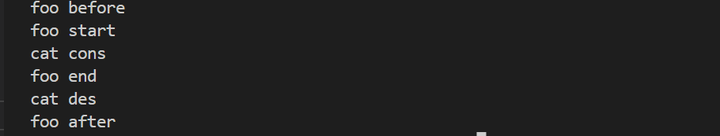
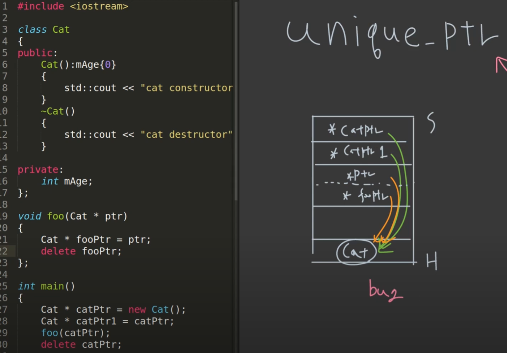
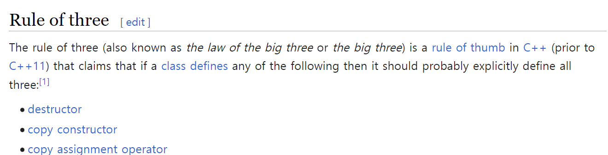
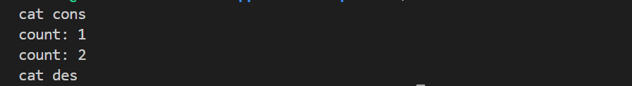
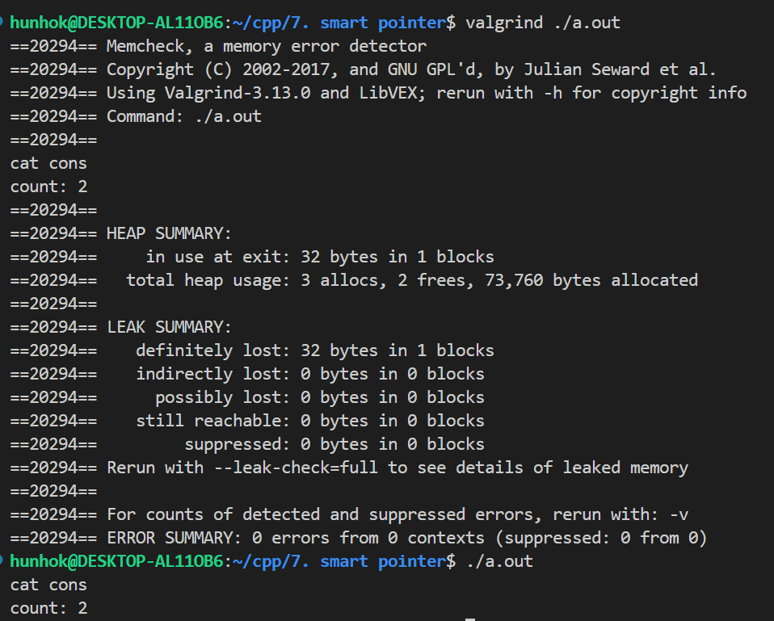
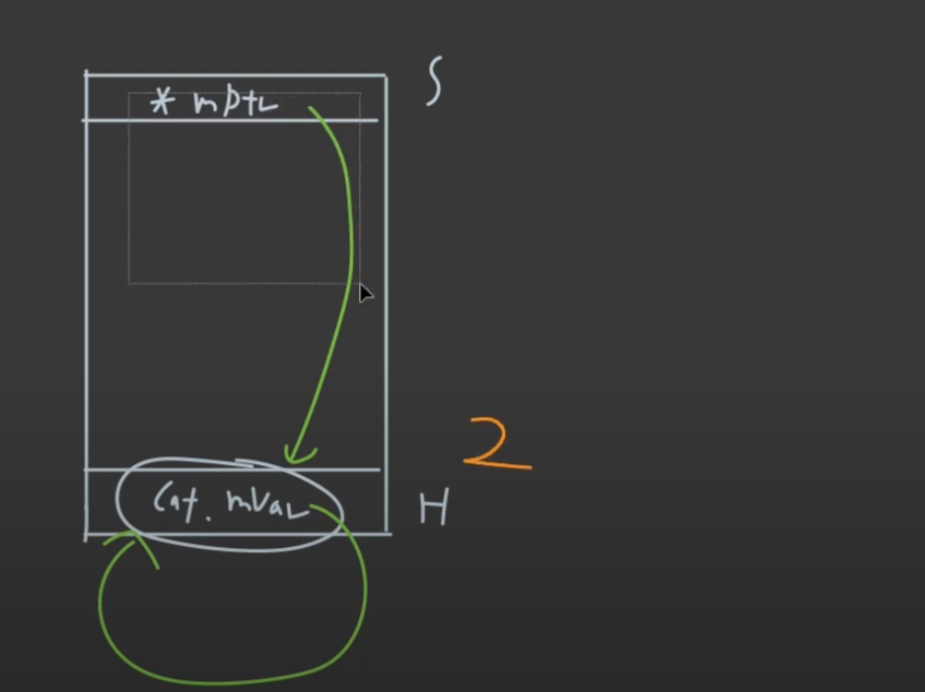
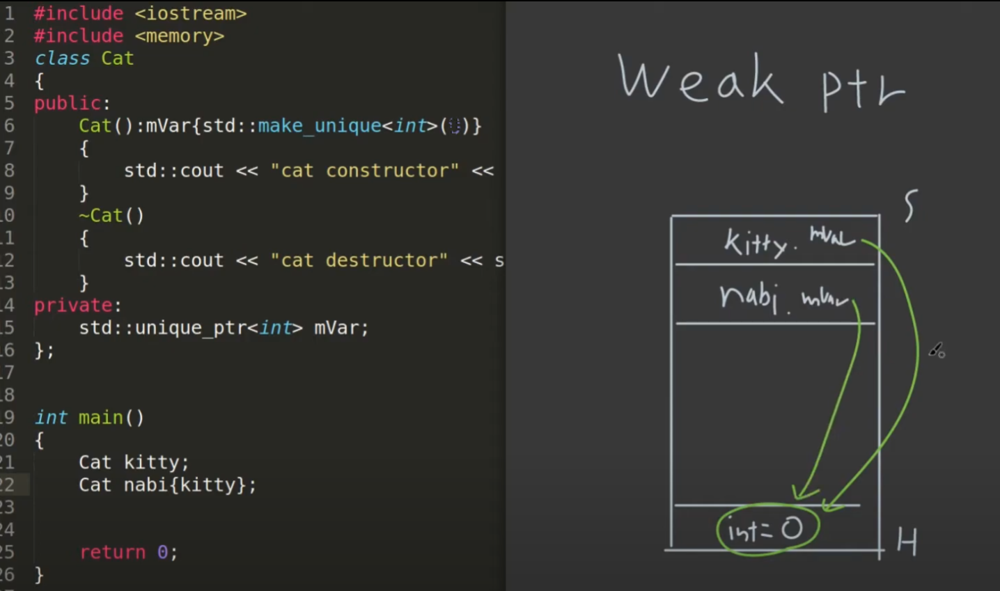

# 06 Smart Pointer
> 나 자신을 믿지말고 smart pointer 써서 Memory Leak을 막자. 

## 1. Smart Pointer

- __종류__
	- unique pointer
	- shared pointer
	- weak pointer

- __목적__
	- RAII (Resource Acqusition Is Initialization)
		- resource의 획득은 초기화.
	- object-resource의 life cycle을 일치시킨다.
		- object: smart pointer
		- resource: ex) heap memory, thread, file access, mutex, DB connection
	- __그냥 Memory Leak을 방지하기 위해서이다.__

---
### Smart Pointer 해제 시점
```cpp
#include <iostream>
#include <array>
#include <memory>

class Cat
{
public:
	Cat(int age): mAge(age)
	{
		std::cout<< "cat cons.\n";
	}
	~Cat()
	{
		std::cout<< "cat des.\n";
	}
private:
	int mAge;
};

void foo()
{
	std::cout<<"foo start\n";
	std::unique_ptr<Cat> cat = std::make_unique<Cat>(3);
	std::cout<<"foo end\n";
}

int main()
{
	std::cout<<"foo before\n";
	foo();
	std::cout<<"foo after\n";

	return 0;
}
```


- __분석__
	- 코드와 결과를 보면 __smart pointer의 memory 해제 시점은 해당 scope의 stack frame이 제거된 후 사라지는 것을 알 수 있다.__
	- stack frame: _void foo()_ 가 끝나고 해제가 된다.


---
## 2. Unique Pointer

### std::unique_ptr

- __특징__
	- exclusive ownership을 제공한다.
		- 하나의 object는 단 하나의 pointer만 가리킬 수 있다.
		- 다른 pointer가 접근, 수정 하는 것을 방지한다.

- __예시__



```cpp
std::unique_ptr<Cat> catPtr1 = std::make_unique<Cat>();
std::unique_ptr<Cat> catPtr2 = std::move(carPtr1);
```

- 위 처럼 [_std::move()_](./2023-10-21-cpp-03-resource-move.md#3-stdmove) 해야 pointer의 소유권을 옮길 수 있다.
	- 확실하게 이전 소유자의 소유권을 없애야한다.

--- 
### 실제로 언제 사용할까?



- [class](./2023-10-24-cpp-04-oop%20copy.md) 챕터에서 배운 것이 member variable에 pointer가 있으면 memory managing을 따로 사용자가 해줘야하기 때문에 constructor, destructor를 rule of three 때문에 만들어야 한다.
	- __이런 문제를 smart pointer를 통해서 해결할 수 있다.__

---
## 3. Shared Pointer

### std::shared_ptr

```cpp
int main()
{
	std::shared_ptr<Cat> catPtr1 = std::make_shared<Cat>();
	std::cout<<"count: "<<catPtr1.use_count()<<"\n";
	std::shared_ptr<Cat> catPtr2 = catPtr1;
	std::cout<<"count: "<<catPtr2.use_count()<<"\n";
}
```



- __특징__
	- shared ownership을 제공한다.
		- _RefCount_ 를 통해 몇 개의 pointer 가리키는지를 알 수 있다.
		- RAII (Resource Acqusition Is Initialization)에 의해서,
			- _RefCount_ 를 통해 object의 life cycle을 공유
			- _RefCount=0;_ 이 되어야 destructor가 call이 된다.

---
### Memory Leak Example 1
```cpp
class Cat
{
public:
	Cat()
	{
		std::cout<<"cat cons. \n";
	};
	~Cat()
	{
		std::cout<<"cat des. \n";
	};	
	std::shared_ptr<Cat> mVar;
};

int main()
{
	std::shared_ptr<Cat> catPtr1 = std::make_shared<Cat>();
	catPtr1->mVar = catPtr1;
	std::cout<<"count: "<<catPtr1.use_count()<<"\n";

	return 0;
}
```




- __분석__
	- 코드와 memory leak 결과, 출력 결과를 보면,
		- memory leak이 발생한다 나와있고,
		- 출력된 _count: 2_ 라고 나온다.
		- __결국 자기들끼리 서로 가리키고 있어 발생한 상황이다.__

---
### Memory Leak Example 2 (Circular 구조)

```cpp
class Cat
{
public:
	Cat()
	{
		std::cout<<"cat cons. \n";
	};
	~Cat()
	{
		std::cout<<"cat des. \n";
	};	

	std::shared_ptr<Cat> mFriend;
};

int main()
{
	std::shared_ptr<Cat> pKitty = std::make_shared<Cat>();
	std::shared_ptr<Cat> pNabi = std::make_shared<Cat>();
	
	pKitty->mFriend = pNabi;
	pNabi->mFriend = pKitty;

	return 0;
}
```

- __분석__
	- 상황적으로 위 예시와 동일한 상황이다.

---
## 4. Weak Pointer

### Weak Pointer를 왜 쓰냐?

- 순환 참조를 막기 위해, 위의 예시들. (Circular 구조)

---
### 사용 

```cpp
class Cat
{
public:
	Cat()
	{
		std::cout<<"cat cons. \n";
	};
	~Cat()
	{
		std::cout<<"cat des. \n";
	};	

	std::weak_ptr<Cat> mFriend;
};

int main()
{
	std::shared_ptr<Cat> pKitty = std::make_shared<Cat>();
	std::shared_ptr<Cat> pNabi = std::make_shared<Cat>();
	
	pKitty->mFriend = pNabi;
	pNabi->mFriend = pKitty;

	return 0;
}
```

> 완벽하게 이해 안됨. 나중에 다시보기


---
## 5. Example

- __문제가 있는 code__

> 잘 안보이는데 make_unique<int>(0) 이다.

- __분석__
	- unique pointer의 exclusive rule을 깨는 것
	- 저렇게 작동한다고 한다.

---
- __해결한 code__

```cpp
class Cat
{
public:
	Cat(): mVar{std::make_unique<int>()}
	{
		std::cout<<"cat cons\n";
	};
	~Cat() noexcept
	{
		std::cout<<"cat des\n";
	};
	Cat(const Cat& other): mVar{std::make_unique<int>(*other.mVar)}
	{
		std::cout<<"copy cons\n";
	};
private:
	std::unique_ptr<int> mVar;
};

int main()
{
	Cat kitty;
	Cat nabi{kitty};

	return 0;
}
```

- __분석__
	- 위와 같이 copy constructor를 짜주면 해결 가능

*[HTML]: HyperText Markup Language
*[CSS]: Cascading Style Sheets
*[JS]: JavaScript