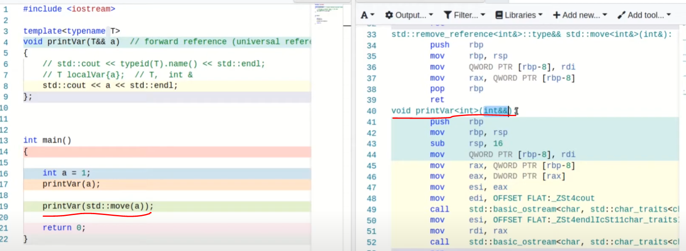
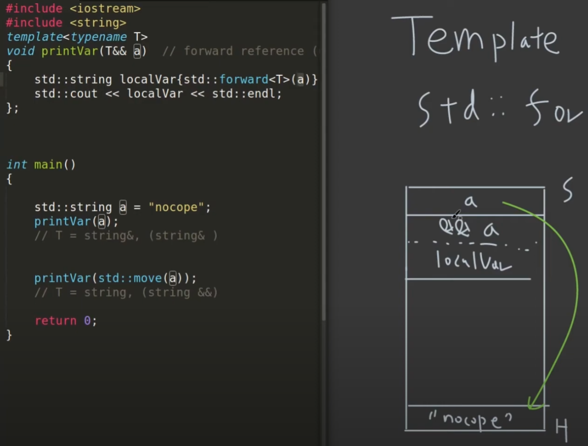
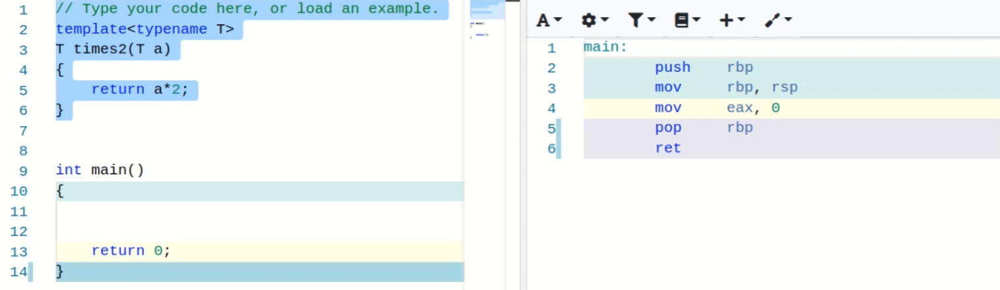
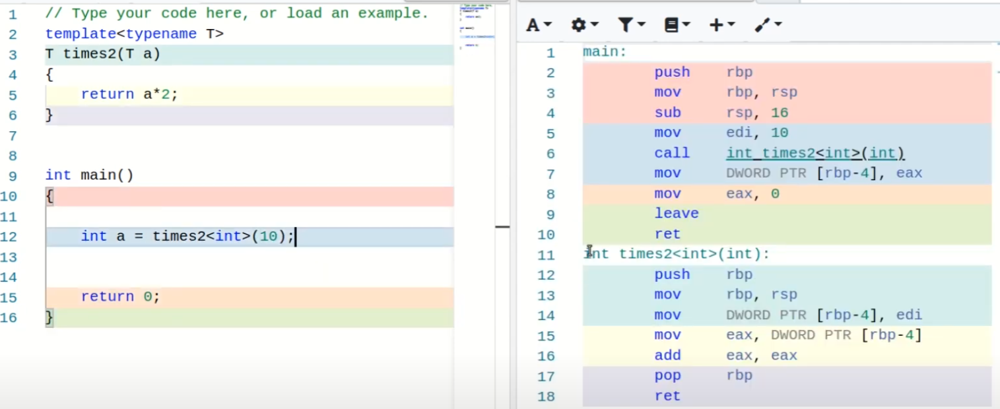
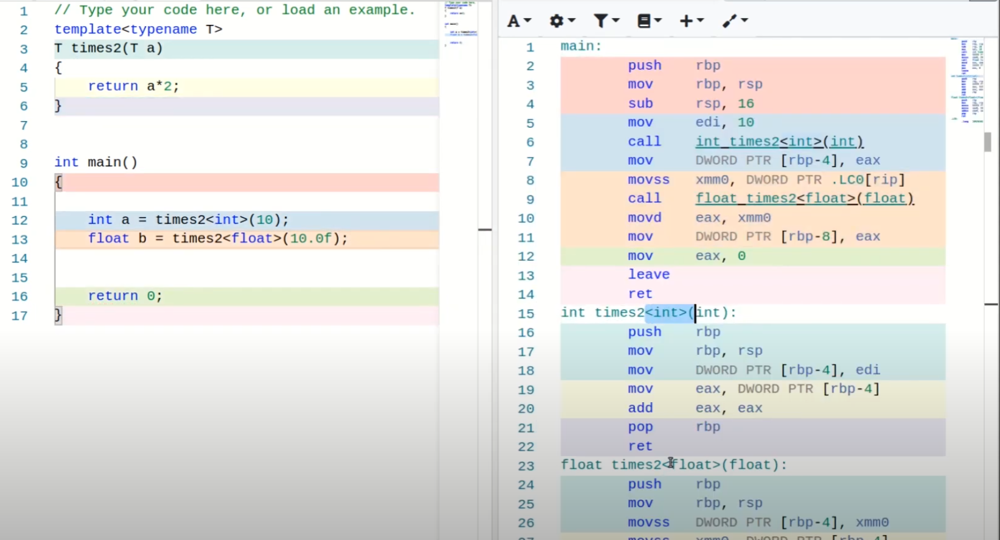
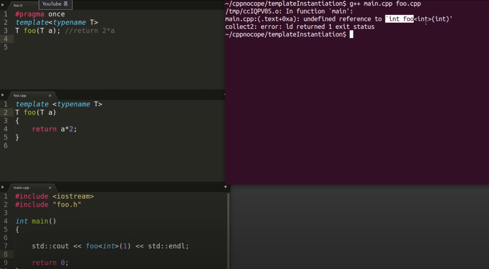
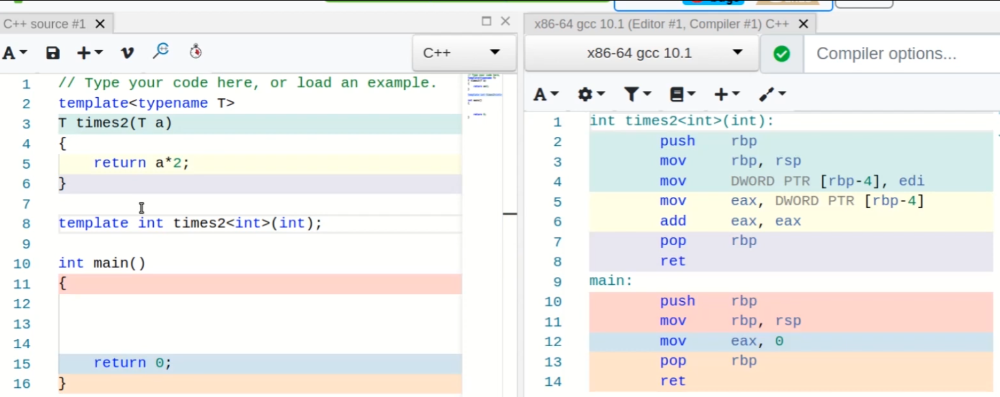

# 07 Template
> 노가다 금지

## 1. Template Deduction (템플릿 타입추론)

### _auto_

```cpp
#include <iostream>

int main()
{
	auto a=1;
	std::cout<<typeid(a).name()<<"\n";

	auto b=1.1;
	std::cout<<typeid(b).name()<<"\n";

	auto c=1.2f;
	std::cout<<typeid(c).name()<<"\n";

	auto d="janghunn";
	std::cout<<typeid(d).name()<<"\n";

	return 0;
}
```

---
### _template_

```cpp
#include <iostream>

template<typename T>
void printVar(T a)
{
	std::cout<<typeid(a).name()<<"\n";
	std::cout<< a <<"\n";
}

int main
{
	auto a=1;
	printVar(a);

	auto b=1.1;
	printVar(b);

	auto c=1.2f;
	printVar(c);

	auto d="janghunn";
	printVar(d);

	return 0;	
}
```

### _template_ 에서의 L-value, R-value

- __먼저 기존의 L-vlaue, R-value (template 적용 전)__

```cpp
#include <iostream>

void printIntLRef(int &a)
{
	std::cout<< a <<"\n";
}

void printIntRRef(int &&a)
{
	std::cout<< a <<"\n";
}

int main
{
	auto a=1;

	//printIntLRef(a);
	printIntRRef(a);

	return 0;	
}
```

- __분석__
	- 위 처럼, R-value를 argument로 받는 function에서는 L-value를 넣으면 compile 되지 않는다.
	- 반대는 가능하다. (L-value를 argument인데, R-value를 넣으면)

---
- __template에서 위 예시를 적용하면 (L-value, R-value)__

```cpp
#include <iostream>

template<typename T>
void printVar(T&& a) // forward refernece (universal reference)
{
	std::cout<< typeid(a).name() <<"\n";
	std::cout<< a <<"\n";
}

int main()
{
	auto a=1;

	//printVar<int>(a); // compile 안됨. L-value를 R-value로 넣어서 그럼.
	printVar(a);

	return 0;	
}
```

- __분석__
	- 주석이 달린 부분에 bracket으로 type을 미리 설정하면, 위의 예시와 같이 작동하지 않지만, 그냥 _template_ 알아서 type deduction하라고 하면, compile이 가능하다.
	- 이를 __forward refernce__ 라고 하고 __universal reference__ 라고도 한다.
		- 이는 __L-value__ 이면서 __R-value__ 이기도 하다.

> 처음 볼 때 이게 뭐지 했다.. 이 pattern을 기억해두자

---
### 실제 Compiler에 의한 Assembly



---
### 복잡하지만 _template_ 을 사용해서 L-value, R-value에 따라 소유권이 바뀔 수도 있다는 것을 기억하자!

```cpp
#include <iostream>
#include <string>

template<typename T>
void printVar(T&& a) // forward refernece (universal reference)
{
	std::string localVar{std::move(a)};
	std::cout<< localVar <<"\n";
}

int main()
{
	std::string a = "janghunn";

	printVar(a);
	printVar(std::move(a)); // 실패! 작동안됨

	return 0;	
}
```

- __분석__
	- _printVar(std::move(a));_
		- 처음 _a_ 가 heap에 _"janghunn"_ 을 가리키고 있지만,
		- 소유권을 _localVar_ 에게 넘겨주기 때문에 (_std::move(a)_),
		- 해당 heap의 _a_ 의 소유권은 _localVar_ 가 들고 있고, function이 끝나면서 _localVar_ 이 사라진다.

---
### 해결책



- __분석__
	- L-value로 들어오면, L-value로 작동하고,
	- R-value로 들어오면, R-value로 처리해서,
	- __copy를 줄이는 효과를 _std::forward_ 를 쓰면 할 수 있다.__

> _template_ 을 쓰면 _std::forward()_ 를 쓰는 것이 좋다. 소유권이 사라질 수도 있기 때문이다. 조금 어렵지만 이런게 있었다라는걸 기억하자.

---
## 2. Template Instantiation (템플릿 인스턴스화)
> compiler가 function(class) _template_ 로 부터 실제 C++ function(class)를 만들어 내는 과정

### Multiple Type Parameters
- type을 여러 개 사용

```cpp
template<typename IT, typename T>
typename IT foo(IT first, IT last, const T& value)
{
	while(first!=last)
	{
		if(*first==value)
		{
			return first;
		}
		first++;
	}
	return last;
};
```

---
### Non Type Parameter
- template 하나랑 size로 사용

```cpp
template<typename T, std::size_t N>
T foo(T a)
{
	return N*a;
};

int main()
{
	std::cout<<foo<double,4>(2.0)<<"\n";
	std::cout<<foo<double,5>(2.0)<<"\n";
}
```

---
### Parameter Pack
- argument를 flexible하게 input으로 사용

```cpp
template<typename ...T>
void foo(T && ...args)
{
	(std::cout<<...<<args)<<"\n";
};

int main()
{
	foo(1,2,3);
	foo("ABC", "janghunn");

	return 0;
}
```

> 사실 아직 _template_ 을 사용하는 구현을 많이 안해봐서 그냥 이런게 있구나 정도로 넘어가려고 한다.

---
### Template Build (instantiation)

- (1)


_template_ 정의만 하고 사용을 안하니 compiler가 따로 인식하지 않는다.

---
- (2)


main에서 사용하니 compile 되었다.

---
- (3)


_int_, _float_ 두 개를 사용하니 함수가 두 개가 compile 되어 binary로 들어간다.
> compile 될 때는 결국 다른 함수로 만들어지는거였다!

---
- (4)


위와 같이 header에 declaration 그리고 cpp에 implementation을 적고 main에서 실행을 하면, undefined라고 뜬다.

---
- (5)

```cpp
template <typename T>
T foo(T a)
{
	return a*2;
}

template int foo<int>(int); //explicit template instantiation
template double foo<double>(double);
```



__그래서, _template_ 을 사용할 때는 모든 구현까지도 header에 넣는게 일반적이다. 또는 cpp에다가 explicit하게 선언해도 된다.__
> 뭔가 그랬던 것 같다.

explicit하게 __template instantiation__ 을 해주면 compiler는 type에 맞게 compile을 미리 해준다.


---
## 3. class, aliasing, variable template

### class template
```cpp
template<typename T>
class Stack
{
public:
	void push(T elem)
	{
		mVec.emplace_back(std::move(elem));
	}
	bool pop(T& elem)
	{
		if(mVec.size()==0)
			return false;
		elem = mVec[mVec.size()-1];
		mVec.pop_back();

		return true;
	}
private:
	std::vector<T> mVec;
};

int main()
{
	Stack<int> stack;

	stack.push(1);
	stack.push(2);
	stack.push(3);

	int n;
	while(stack.pop(n))
		std::cout<< n <<"\n";

	return 0;
}
```

- class에서도 _template_ 을 써서 flexible하게 사용 가능

### Aliasing Template (별명)

```cpp
#include <iostream>

template<typename T>
using janghunnKeys = std::vector<std::array<T,64>>

int main(int argc, char const *argv[])
{
	// using janghunnKeys = std::vector<std::array<T,64>>

	janghunnKeys<float> floatKeys;
	janghunnKeys<double> doubleKeys;

	return 0;
}
```

- 기존의 aliasing 기능도 가능하고, __그 type을 compile time에 정해줄 수 있는 것__

*[HTML]: HyperText Markup Language
*[CSS]: Cascading Style Sheets
*[JS]: JavaScript

---
## 4. Template _concept_

- _concept_
	- template type의 제한을 두는 것

---
### Type 제한

```cpp
#include<concepts>
#include<iostream>
#include<string>

//template <typename T> requires std::integral<T>
template<typename T>
concept Summable = std::integral<T> || std::floating_point<T>;

template <typename T> requires Summable<T>
T sum(T a, T b)
{
    return a+b;
};

int main()
{
    std::cout << sum<int>(10,10) << std::endl;
    std::cout << sum<uint64_t>(30,40) << std::endl;
    
    std::cout<<sum<std::string>("abc","def") << std::endl;
}
```

- __분석__
	- _sum()_ 이라는 함수를 template으로 할 수 있는데,
	- _int_, _float_ 만 받으려고 할 때,
		- _string_ 이라는 type은 제한을 두려고 할 때, 

---
### 연산자 제한

```cpp
#include<concepts>
#include<iostream>
#include<string>

template <typename T>
concept Addable = require (T x)
{
	x+x;
	x-x; // string은 불가
};

template <typename T> requires Addable<T>
T sum(T a, T b)
{
    return a+b;
};

int main()
{
    std::cout << sum<int>(10,10) << std::endl;
    std::cout << sum<uint64_t>(30,40) << std::endl;
    
    std::cout<<sum<std::string>("abc","def") << std::endl; // error
}
```

> 아무튼 Over use 하면 안된다.

*[HTML]: HyperText Markup Language
*[CSS]: Cascading Style Sheets
*[JS]: JavaScript