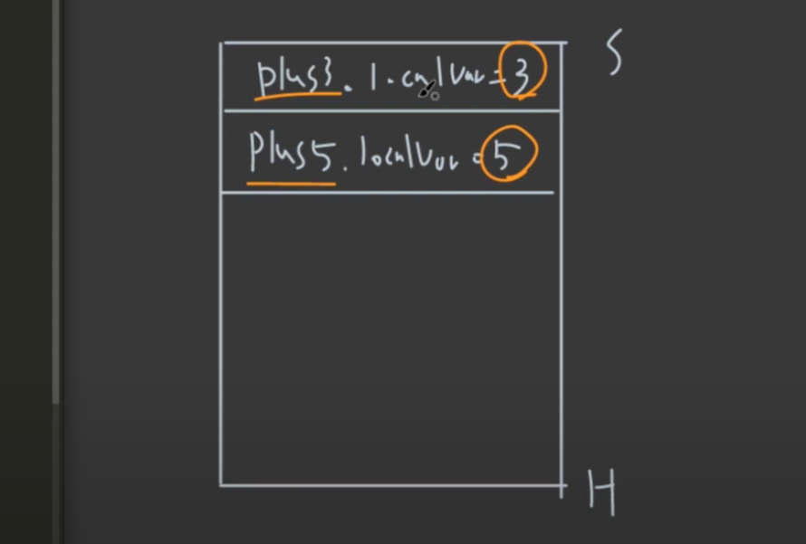
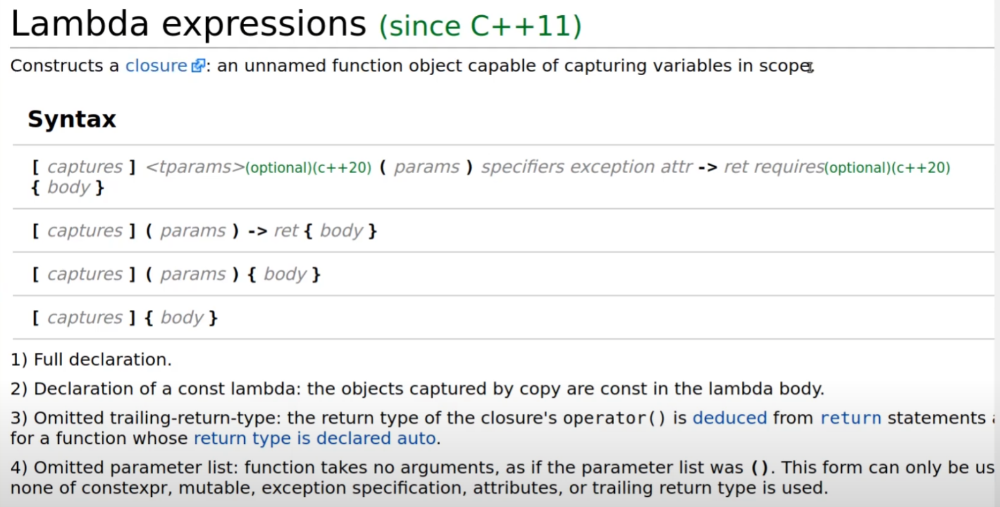
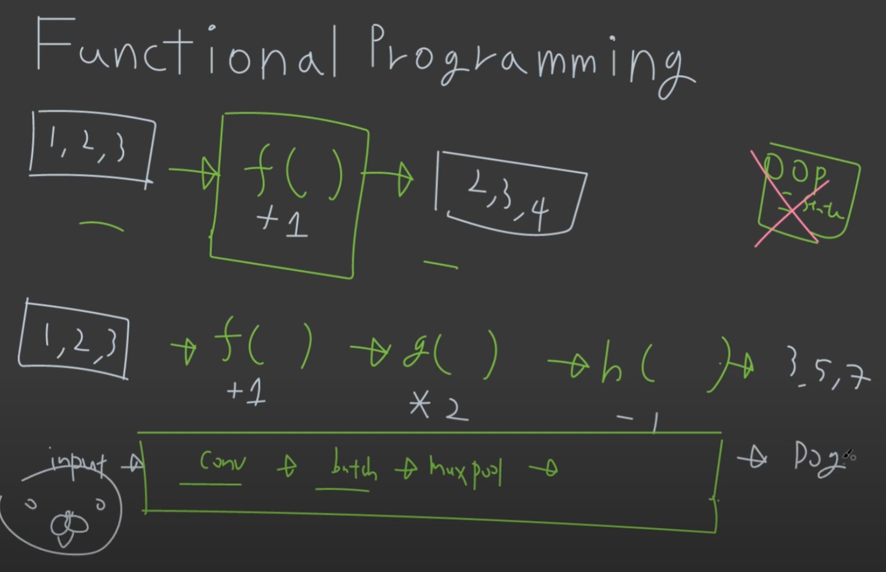

# 08 Lambda
> 활용하는 방법이 많지만, 아직은 와닿지는 않는다. 어렵다.

## 1. Functional Programming

### C++

- ___C++_ 이 지속되는 이유__
	- _C++_ 은 OOP paradigm이 중심이 되는 language
	- 하지만, _C++_ 보다 다른 language들이 더 쉽게 OOP를 지원해줌
	- _C++_ 은 그렇기에 _high performance_ 측면으로 언어를 유지해옴.

- _high performance? Cache Hit!!_
	- 성능이 높다는건 cache 활용이 높다는 것
	- 그러기 위해서는 _Data Oriented Programming_ 이 발전이 되어야함.

- _Lambda_
	- _C++11_ 부터 lambda expression을 지원하면서 functional programming이 시작됨.
	- STL 만큼 유용하게 _lambda_ 가 사용된다고 함.

---

### _lambda_ 개념
- function을 variable 처럼 다루는 것이 주요 개념
- function object를 주로 얘기하는 언어가 _javascript_

---
### function object

- __code__

```cpp
#include<iostream>

class Plus
{
public:
    explicit Plus(int a): localVar{a} {}
    int operator() (int x) const
    {
        return localVar + x;
    }
private:
    int localVar;
};

int main()
{
    Plus plus3{3};
    Plus plus5{5};
  
    std::cout<<plus3(10)<<std::endl;
    std::cout<<plus5(10)<<std::endl;
    
    return 0;
}
```

- cpp에서는 위와 같이, class로 정의하여 function object를 정의해서 function을 사용할 수 있다.

- __memory space__



---
## 2. _lambda_ expression

### _lambda_



	- _capture_: [] // capture by value, capture by reference, this
	- _params_: ()
	- _body_: {}

- __code__

```cpp
auto lambdaPlus3 = [localVar = 3](int x)
{
	return localVar + x;
};
```

- __분석__
	- 이게 _lambda_ 쓰기 전 코드와 assembly가 똑같다.
	- function object와 _lambda_ expression은 코드가 달라도 기능은 같다.

---
### _capture []_

- capture by value
	- deep copy
	- stack 위에 capture variable이 존재하게 된다.
	- 즉, 메모리가 소비된다.

- capture by reference
```cpp
VERTLARGEOBJECT object
auto lambda = [&object](int x) // [&] 이렇게 implicit하게 적어도 찾아서 적용된다
{
	return object + x;
};
```

> microsoft lambda expression 을 참고하면 더 깊게 공부할 수 있다.

---
## 3. _capture this_

### _this_

```cpp
#include <iostream>

class Cat
{
public:
    explicit Cat(int age): mAge{age} {}
    void speak() const
    {
        std::cout<<"meow"<<std::endl;
    }
    void test() const
    {
        // &, this를 capture한 것이랑 같다.
        auto lambda= [this]()
        {
            std::cout<<"lambdafunction"<<std::endl;
            std::cout<<this->mAge<<std::endl;

            this->speak();
        };

        lambda();
    }
private:
    int mAge;
};

int main()
{
    Cat kitty{1};
    kitty.test();

    return 0;
}
```

---
### STL

- for_each
	- vector 내에서 반복적으로 적용할 수 있다.

```cpp
std::for_each(nums.begin(), nums.end(), func);
```

- 사용 방식은 위와 같다.
- 장점은 _func_ 안에 lambda function을 바로 적용할 수 있다.

```cpp
std::vector<int> nums{1,2,3,4,5,6,7,8,9,10};

std::for_each(nums.begin(), nums.end(), [](int &n)
{
	n += 10;
});
```

- 위와 같이 바로 lambda function을 적용 가능하다.
- for_each 와 lambda function을 합쳐서 쓰는 것 가능

---
## 4. Higher Order Functions + STL

### for_each + lambda function

```cpp
std::for_each(nums.begin(), nums.end(), func);
```

```cpp
std::vector<int> nums{1,2,3,4,5,6,7,8,9,10};

std::for_each(nums.begin(), nums.end(), [](int &n)
{
	n += 10;
});
```

---
### erase + std::remove_if + lambda

```cpp
std::vector<int> nums{1,2,3,4,5,6,7,8,9,10};

auto filterOdd = [](int n)
{
	return n%2 ==1;
};

nums.erase(std::remove_if(nums.begin(), nums.end(), filterOdd), nums.end());
```

```cpp
std::vector<int> nums{1,2,3,4,5,6,7,8,9,10};

nums.erase(std::remove_if(nums.begin(), nums.end(), auto filterOdd = [](int n)
{
	return n%2 ==1;
}), nums.end());
```

> 선호하는 스타일을 사용하면 된다.

---
### sort + lambda

```cpp
std::vector<int> nums{1,2,3,4,5,6,7,8,9,10};

std::sort(nums.begin(), nums.end(), [](int a, int b)
{
	return a>b;
});
```

- vector를 sort할 수도 있고,

---
```cpp

std::vector<int> nums{1,2,3,4,5,6,7,8,9,10};

std::sort(nums.begin(), nums.end(), [](int a, int b)
{
	return std::abs(a-5)<std::abs(b-5);
});
```

- 필요에 따라 특정 값에 가까운 순으로 정렬 (왜 그런지는 STL 파트에서 공부)

---
### reduce + lambda

```cpp
// sum
int sum = std::reduce(nums.begin(), nums.end(), 0, [](int a, int b)
{
	return a+b;
});
std::cout<<sum<<std::endl;
```

```cpp 
// multiply
int mul = std::reduce(nums.begin(), nums.end(), 1, [](int a, int b)
{
	return a*b;
});
std::cout<<mul<<std::endl;
```

- numeric, 3번째 파라미터는 initial value이다.

---
## 5. std function


```cpp
#include <iostream>
#include <functional>
#include <vector>

class FunctionObj
{
public:
	void operator() (int i)
	{
		std::cout<<"functionObj"<< i << "\n";
	}
};

void freeFunction(int i)
{
	std::cout<<"freeFunction"<< i << "\n";
};

void runFunction(int i, const std::function<void(int)>& fn)
{
	fn(i);
};

void runFunctions(const std::vector<std::function<void(int)>> functions)
{
	int i=0;
	for(const auto &fn: functions)
	{
		fn(++i);
	}
}

int main()
{
	// 1
	void (* fnPtr)(int);
	fnPtr = freeFunction;
	runFunction(10, fnPtr);

	// 2
	FunctionObj functionObj;
	runFunction(10, functionObj);

	// 3
	auto lambdaFn = [](int i)
	{
		std::cout<<"lambdaFunction"<< i <<"\n";
	};
	runFunction(10,lambdaFn);

	//4, run all
	std::vector<std::function<void(int)>> functions;
	functions.emplace_back(freeFunction);
	functions.emplace_back(functionObj);
	functions.emplace_back(lambdaFn);

	runFunctions(functions);

	return 0;
}
```

> 일단 살짝 혼미해지기 시작했다..

- __정리__
	- __function 들고다니는 것이 핵심.__
	- __또한, function 내부에서 argument로 function을 들고 다닐 수 있게 하는 것__

---
1) c style에서는 function pointer를 생성해서 그것을 넣어주는 것이고

2) C++은 class function object 형식을 넣어주고

3) lambda function 자체를 넣어줄 수도 있다.

4) 이러한 function들이 각각 선언이 가능하기에 vector를 이용하여 functions container를 만들고 emplace_back으로 각각의 function을 넣어주며, 한번에 run을 시켜 동작시키는 구조가 가능하다.	

---
### In Deep Learning



- input과 output 사이에 function으로만 이루어져 side effect가 절대 존재하지 않고 신뢰성이 높다
- 이러한 함수는 특히나 deep learning code에서 많이 사용되어 진다.

---
### OOP vs. Functional Programming
> 답은 없다. task에 따라.

*[HTML]: HyperText Markup Language
*[CSS]: Cascading Style Sheets
*[JS]: JavaScript