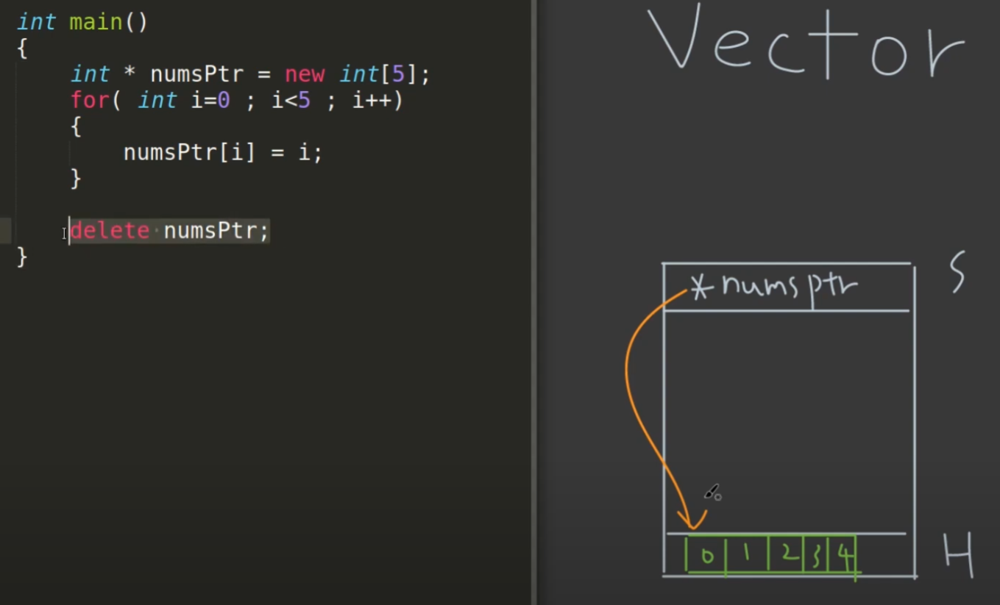
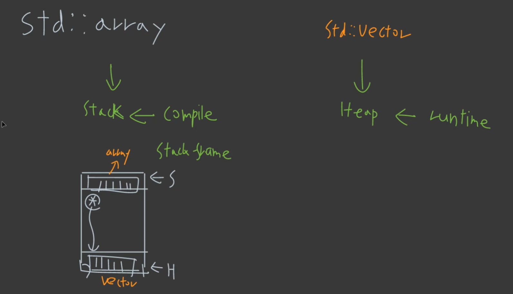
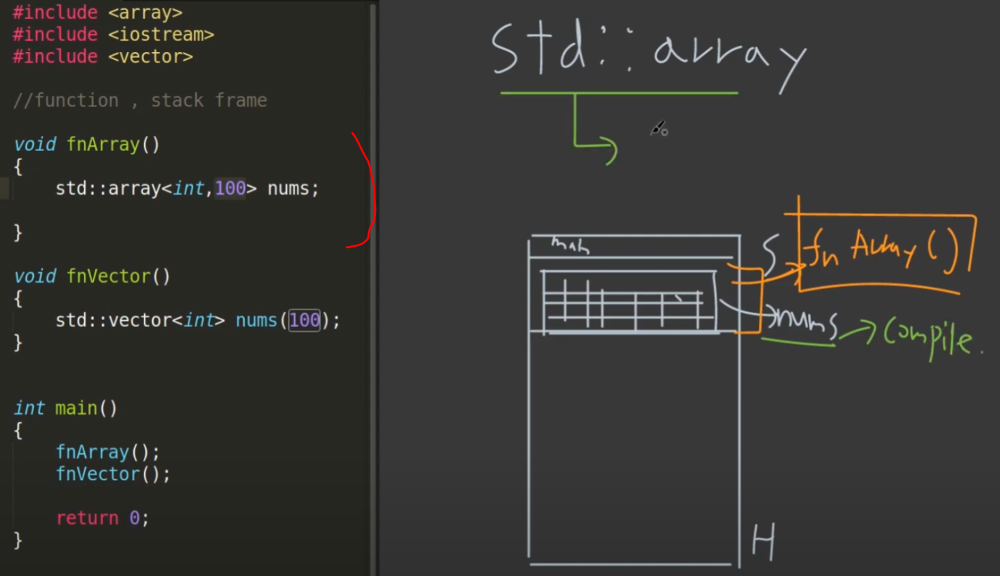
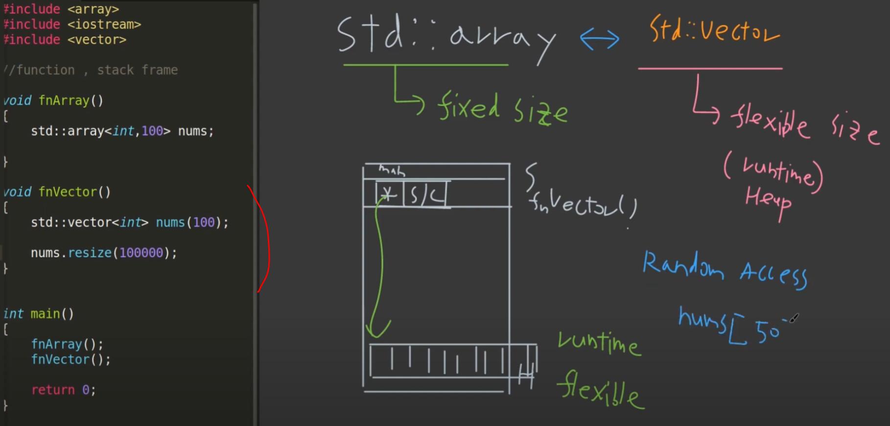
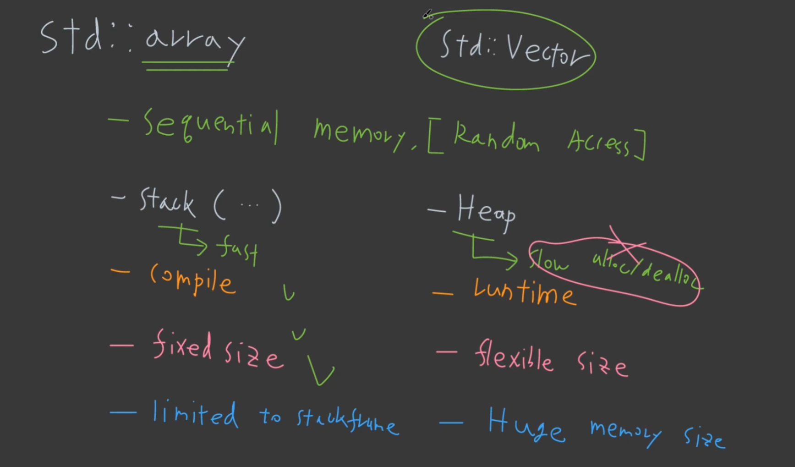
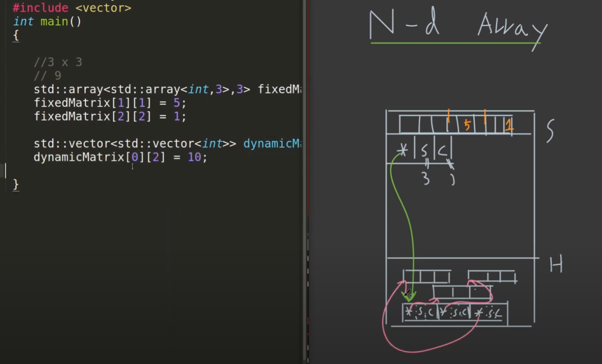

# 09 Vector
> Dynamic Size Array를 encapsulate 함.

## 1. Vector
- Sequence Container
- Data는 Heap에 존재
- Dynamic Size 사용 가능

---
### _new / delete_


- _new_ 로 dynamic size array를 구현할 수 있지만, 이 경우 _delete_ 키워드를 빼먹으면 memory leak이 발생할 수 있음.

---
### _std::vector_
- 그냥 vector를 쓰면 된다. memory leak 방지
- loop에서는 iterator 보다는 size_t를 쓰자.
	- vector의 memory managing이 들어와 주소가 변경될 위험이 있음.
	- 하지만, 가장 최적화된 것은 ranged for 형식을 쓰자

```cpp
for(auto &e: nums)
{
	// ...
}
```

---
### Time Complexity
- Random Access: __O(1)__
	- vector의 첫번째 주소와 sequence 하기 때문에 가능
- _emplace back, pop back_: __O(1)__
	- vector의 끝에 접근 후 더하거나 빼기, 하지만 insertion시 __O(n)__ 이 발생할 수 있다.
- _emplace(nums.begin(), 3), erase(nums.begin()+3)_: __O(n)__
	- 중간에 insertion, deletion을 해야하기 때문에 다른 object들이 move 해야함.

---
### push_back (X) vs. emplace_back (O)

```cpp
Cat& cat0 = cats.emplace_back("cat0", 1);
```
- void 반환이랑 reference 반환이 있어, 위와 같이 반환할 수 있다.(C++17)

---
```cpp
cats.emplace_back(Cat("cat0", 1)); // temporal memory 생성 후 move operation으로 추가

cats.emplace_back("cat0", 1); // temporal space 없이 추가
```

- __분석__
	- 둘다 copy는 없지만, temporal memory를 생성하냐 안하냐에 차이

---
## 2. Vector Memory

### Vector의 기본 메모리
- vector pointer의 size는 24bytes
	- 8: address
	- 8: size
	- 8: capacity

---
### emplace_back / time complexity
- capacity를 넘쳤을 경우 __O(n)__, 일반적으로 capacity는 __2배__ 로 증가
- _reserve()_ 로 보장할 수 있음. 어느정도 최대치만 잡아서 만들어주는게 좋음.

---
### _std::string in std::vector_
- string을 담는 object의 경우 emplace_back을 하면 constructor만 불릴 줄 알았지만,
- 그 다음 object들을 넣을 때, 이전까지 들어간 object들이 새로 할당받은 공간으로 copy constructor가 발동되어 복잡하게 진행된다.

---
## 3. Vector Loop

1. index loop
2. iterator loop
3. range-based for loop

- __분석__
	- index, range-based for loop 둘 다 시간이 비슷하다.
	- 하지만 가장 안전한 것은 index based이다. vector size 변경으로 인해 memory 시작 위치가 변경될 수 있으므로,
	- 가장 가독성 좋은 것은 range-based for loop

---
## 4. _erase, remove_

### _erase_

	0 1 0 1 0 1 0

- pointer 두 개를 이용해서
	 - move 시킬 장소를 가리키는 pointer와,
	 - 숫자를 탐색하는 pointer 하나를 사용한다.

```cpp
auto rm_itr = std::remove(nums.begin(), nums.end(), 0);
```

- 즉, remove의 결과를 돌리고 나면, vector의 크기는 변화가 없고,
- vector는 __111__ 1010으로 변경되고 4번째 1을 가리키는 iterator가 반환된다.
- 위의 결과로 반환된 iterator를 이용해서 erase를 사용하면 4번째 1 이후로 vector를 삭제시켜 다음의 코드를 완성할 수 있다.

```cpp
nums.erase(std::remove(nums.begin(), nums.end(), 0), nums.end())
```

- __분석__
	- 위와 같이 코드를 돌리면 해당 원소를 지운 vector가 반환된다.
	- 그래서 원소를 제거한다고 해서 $O(n^2)$ 가 아닌 $O(n)$ 이다.

---
### std::remove_if
- 위 함수를 넣으면 특정 원소 뿐만 아니라 함수를 넣을 수 있다.
- 즉, 저번 chapter에서 배운 lambda function을 넣을 수 있다.

```cpp
nums.erase(std::remove_if(nums.begin(), nums.end(), [](int n){
if(n%2==0) return true;
else return false;
}), nums.end());
```

---
## 5. _std::array_

### vector와의 차이점


- __array__: stack에 존재, compile time
- __vector__: heap에 존재, run time

---
### array, compile time


- array는 compile time이기 때문에 fixed size를 미리 알고있어야 한다.

---
### vector, runtime


- run time에 memory 공간을 마음대로 조절 가능 (flexible size)

---
### array, vector 공통점
- random access를 지원한다.
- sequence한 memory한 공간

---
### Summary


---
## 6. Vector Algorithm

1. sorting
2. find
3. min/max
4. reduce

---
### sorting

- std::sort, O(NlogN)

```cpp
std::sort(nums.begin(), nums.end());
```

---
- std::stable_sort, O(NlogN)

```cpp
std::stable_sort(nums.begin(), nums.end());
// 동일한 기준을 sort하고 2차적으로는 처음의 정렬 순서를 보장한다. 
```

---
- std::partial_sort, O((last-first)log(middle-first))

```cpp
std::partial_sort(nums.begin(), nums.begin()+3, nums.end());
```

- begin~begin+2 < begin+3 까지만 정렬을 진행한다.
- 즉, 내가 원하는 정렬 기준으로 처음 3개만 달라는 것이며, 
- 이를 쓰는 이유는 time complexity가 좋기 때문이다.

---
- std::nth_element

```cpp
std::nth_element(nums.begin(), nums.begin()+nums.size()/2. nums.end());
```

- nth element를 뽑아주고, 
- vector 자체도 바뀌며, median을 기준으로 좌우측은
- median을 기준으로 정렬되어있고 내부는 정렬되어있지않다.

---
### min/max

- std::min_element, std::max_element

```cpp
std::vector<int> v{3,1,4,1,5,9};

std::vector<int>::iterator result = std::min_element(v.begin(), v.end());
std::cout<<"min element at: " << std::distance(v.begin(), result);
```

---
- std::minmax_element

```cpp
const auto v = { 3, 9, 1, 4, 2, 5, 9 };
const auto [min, max] = std::minmax_element(begin(v), end(v)); //pair<iter, iter>
std::cout << "min = " << *min << ", max = " << *max << '\n';
```

--- 
### find

- std::find, O(n)

```cpp
const std::vector<int> nums{0,1,2,3,4};
const auto resultItr = std::find(nums.begin(), nums.end(), 2);

if(resultItr != nums.end()) //found
{
	std::cout<<"idx: "<<std::distance(nums.begin(), resultItr)<<std::endl;
}
else
{
	std::cout<<"no elem found"<<std::endl;
}
```

정렬되어있으면 O(logn)으로 binary search를 할 수 있음

---
- std::binary_search

```cpp
#include <iostream>
#include <algorithm>
#include <vector>

int main()
{
    std::vector<int> haystack{1, 3, 4, 5, 9};
    std::vector<int> needles{1, 2, 3};

    for (auto needle : needles)
    {
        std::cout << "Searching for " << needle << '\n';
        if (std::binary_search(haystack.begin(), haystack.end(), needle))
            std::cout << "Found " << needle << '\n';
        else
            std::cout << "no dice!\n";
    }
}
```

---
### reduce

### std::accumulate
```cpp
#include <iostream>
#include <vector>
#include <numeric>
#include <string>
#include <functional>

int main()
{
    std::vector<int> v{1, 2, 3, 4, 5, 6, 7, 8, 9, 10};

    int sum = std::accumulate(v.begin(), v.end(), 0);
    int product = std::accumulate(v.begin(), v.end(), 1, std::multiplies<int>());

    std::cout << "sum: " << sum << '\n'
              << "product: " << product << '\n';
}
```

### std::reduce

```cpp
#if PARALLEL
#include <execution>
#define SEQ std::execution::seq,
#define PAR std::execution::par,
#else
#define SEQ
#define PAR
#endif
#include <chrono>
#include <iomanip>
#include <iostream>
#include <numeric>
#include <utility>
#include <vector>

int main()
{
    std::cout.imbue(std::locale("en_US.UTF-8"));
    std::cout << std::fixed << std::setprecision(1);
    auto eval = [](auto fun)
    {
        const auto t1 = std::chrono::high_resolution_clock::now();
        const auto [name, result] = fun();
        const auto t2 = std::chrono::high_resolution_clock::now();
        const std::chrono::duration<double, std::milli> ms = t2 - t1;
        std::cout << std::setw(28) << std::left << name << "sum: "
                  << result << "\t time: " << ms.count() << " ms\n";
    };

    {
        const std::vector<double> v(100'000'007, 0.1);
        eval([&v]{ return std::pair{"std::accumulate (double)",
            std::accumulate(v.cbegin(), v.cend(), 0.0)}; } );
        eval([&v]{ return std::pair{"std::reduce (seq, double)",
            std::reduce(SEQ v.cbegin(), v.cend())}; } );
        eval([&v]{ return std::pair{"std::reduce (par, double)",
            std::reduce(PAR v.cbegin(), v.cend())}; } );
    }

    {
        const std::vector<long> v(100'000'007, 1);
        eval([&v]{ return std::pair{"std::accumulate (long)",
            std::accumulate(v.cbegin(), v.cend(), 0l)}; } );
        eval([&v]{ return std::pair{"std::reduce (seq, long)",
            std::reduce(SEQ v.cbegin(), v.cend())}; } );
        eval([&v]{ return std::pair{"std::reduce (par, long)",
            std::reduce(PAR v.cbegin(), v.cend())}; } );
    }
}
```

- 위에 accumulate는 single thread 이고,
- reduce는 multi_thread용이다.
- 앞에 다음과 같은 키워드를 붙여야한다.

```cpp
std::execution::par
```

---
## 7. N-D Array

```cpp
//stack
std::array<std::array<int,3>,3> fixedMat;

//heap
std::vector<std::vector<int>> DynamicMat(3, std::vector<int>(3));
```



- __분석__
	- __2D를 선언해도 Memory 상에서는 Sequential 하다.
	- 위의 그림에서 __key point__ 는 stack에 존재하는 array는 단순하지만,
	- vector의 경우 2차원으로 선언했을 때, stack에서 pointer 하나가 생성되어 heap으로 3개의 pointer를 가리킨다.

--- 

### In Computer Vision,

- CV 에서는 sequential하게 안되어있으면, 성능의 손실이 발생한다.
	- 이를 방지하기 위해, matrix class를 template으로 선언하여 사용할 수 있다.
	- row, col을 template 안에 넣어서 compile time에 할 수도 있고,
	- 따로 member variable로 넣어서 run time에 정의할 수도 있다.
- 2차원 이미지라고 하더라도 메모리상에서는 1차원으로 구현하면 성능에서의 향상이 생긴다.

```cpp
#include<iostream>
#include<vector>

template <typename T, int ROW, int COL>
class Matrix
{
public:
    Matrix(): mMatrix(ROW*COL,0)
    {
    }
    T& operator() (int rowIdx, int colIdx)
    {
        const int idx = rowIdx * COL + colIdx;
        return mMatrix[idx];
    }
private:
    std::vector<T> mMatrix;
};

int main()
{
    Matrix<int,10,10> mat;
    mat(3,3) = 3;
    mat(4,3) = mat(3,3)*10;

    std::cout<< mat(4,3) <<std::endl;
}
```

- __문제점__
	- 하지만 이 경우, Parallel Thread를 사용할 떄, 연속한 data를 다른 thread가 같이 접근할 때, __False Sharing__ 이 발생한다.
	- 이는 padding을 통해 해결해야한다.
	- 하지만 benchmark를 통해 test를 실시해서 실제로 속도를 검사해야한다.

---
### Loop
> Cache 성능으로 인해 ndarray에서는 아래차원을 inner loop로 해야지 계속 접근하기 쉽다. cache line 방향으로. 이거에 대해서는 scott meyer의 강의로 따로 리뷰하겠다..


---
## 8. deque

- random access: O(1)

- Double ended queue,

	`std::deque` (double-ended queue) is an indexed sequence container that allows fast insertion and deletion at both its beginning and its end.

	As opposed to [std::vector](https://en.cppreference.com/w/cpp/container/vector "cpp/container/vector"), the elements of a deque are not stored contiguously:

- 연속적이지 않다.

- 아마 결국 앞에다가 element들을 넣을 경우에 쓸만하지 나머지에는 잘 모르겠다.

*[HTML]: HyperText Markup Language
*[CSS]: Cascading Style Sheets
*[JS]: JavaScript