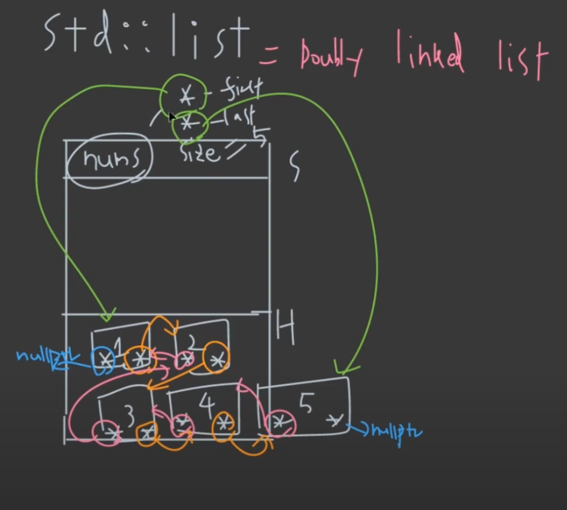
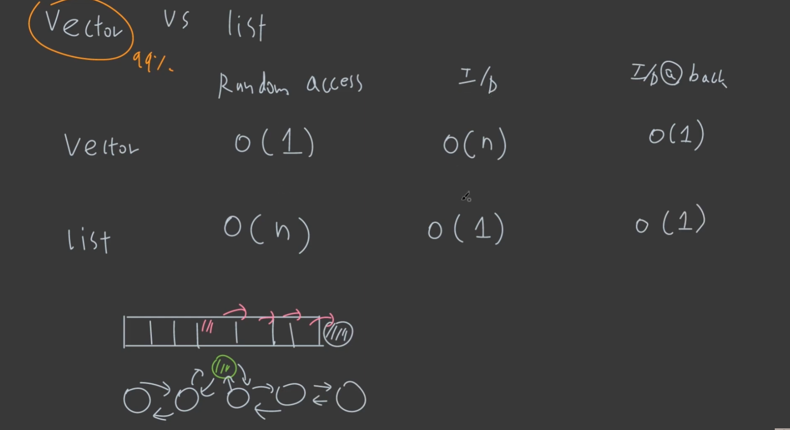

# 10 List
> doubly-linked list

## 1. _std::list_
- random access가 지원되지 않고,
- doubly-linked list 라서 거의 사용하지 않는다.

- __구조__ (24 bytes)
	- 8 bytes: first pointer
	- 8 bytes: last pointer
	- 8 bytes: size

```cpp
#include<iostream>
#include<list>

int main()
{
	std::list<int> nums{1,2,3,4,5};

	for(auto &num: nums)
	{
		std::cout<<num<<" ";
	}
	std::cout<<"\n";

	return 0;
}
```

- __구조 (그림)__


---
### Time Complexity
- __find__: O(n)
- __Insertion, Deletion__: O(1)

> 하지만 의미가 없는게 find를 무조건 해야하기 때문에, random access를 지원하지 않는 list가 insertion, deletion O(1)을 지원한다는 것은 아니라고 보면 된다.

---
### std::forward_list

- singly-linked list
- pointer의 구성은 단일 pointer 하나로 구성되어 있다. (8 bytes)

---
## 2. _std::vector vs. std::list_



- __분석__
	- 하지만 find metric을 추가하면, vector와 list가 똑같이 O(n)이지만, sequential 하기 때문에 실제로는 vector의 find가 훨씬 빠르다. (cache line)
	- 또한 병렬 프로그래밍에서는 list를 core마다 데이터를 나누는 것 자체가 힘들다.

*[HTML]: HyperText Markup Language
*[CSS]: Cascading Style Sheets
*[JS]: JavaScript