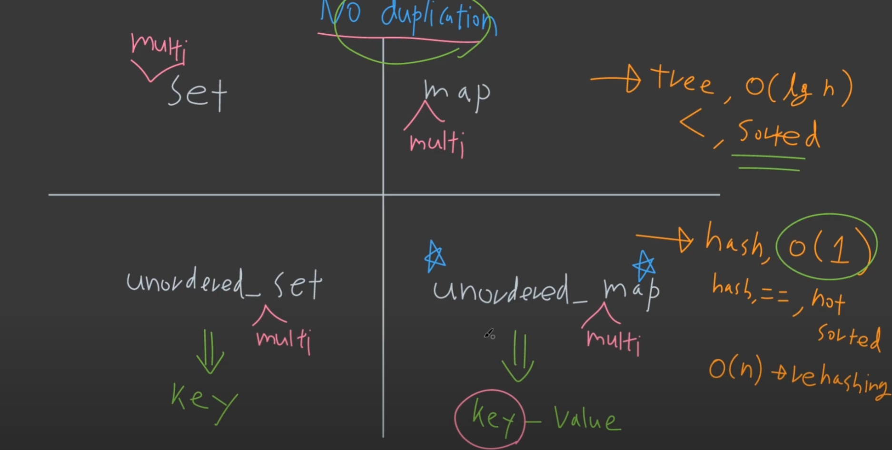

# 11 Set Map Hash
>> set map hash

## 1. _std::set_

- __정리__
	- key만 저장, value X
	- data는 heap에 존재
	- red-black tree 구조로 구현되어있고
	- 중복을 허용하지 않음
	- 내부적으로 sorting이 되어있음. (RBTree, balanced BST)

- __time complexity__
	- find: O(logN)
	- insertion, deletion: O(logN)

또한, function object를 이용해서 comparison 기준을 사용자가 설정할 수도 있다.

```cpp
struct customFn
{
	bool operator() (const int lhs, const int rhs) const 
	{
		return lhs > rhs;
	}
};

int main()
{
	std::set<int, customFn> nums{1,2,3,4,5};

	for(const int &num: nums)
	{
		std::cout<<num<<" ";
	}
	std::cout<<"\n";
}
```

- std::multiset
- std::unordered_set (hash)

---
## 2. _std::map_

- map: set + (key, value) 개념
	- 구조는 set이랑 비슷하지만,
	- key, value가 구성되어있고 접근은 first, second로 접근

- 중복도 또한 _std::set_ 이랑 비슷하므로, key 값이 같으면 들어가지 않는다.
- 따로 중복을 처리하면 _numPairs[1] = 200_ 처럼 override 해준다.
	- bracket을 써서 접근하는걸 조심해야 하는데, 그 이유는 아직 만들지 않는 key 값을 접근하게 되면, dummy 값으로 자동생성 된다.
- _std::map<int, string>_ 도 가능

---
## 3. std::unordered_set

- 구성
	- key
	- hash
	- keyEqual
	- allocator

- 특징
	- insertion, deletion, find가 전부 O(1)이라는게 큰 특징이다.
	- hash를 사용하기 때문,

---
### Hash Function


- 다른 input을 넣으면 아주 작은 확률을 제외하고 나서는 output이 달라야한다.

---
### 그래서 Hash로 어떻게 만들어지는 것인가?

```cpp
#include<iostream>
#include<unordered_set>
#include<string>

int main()
{
	std::unordered_set<std::string> uordSet;

	uordSet.emplace("abc");
	uordSet.emplace("def");
	uordSet.emplace("ghi");
	uordSet.emplace("jkl");

	std::cout<<"bucket count: "<<uordSet.bucket_count()<<"\n";

	for(const auto& str: uordSet) std::cout<< str <<": "<< std::hash<std::string{}(str)<<", bucket: "<< uordSet.bucket(str)<<"\n";

	uordSet.find("abc"); // O(1)
	uordSet.erase("abc"); // O(1)
}
```


- __정리__
	- string to Hash value 로 바꾸면, 각 string마다 다른 hash value가 나오지만, 이를 인덱스로 바로 사용하기에는 hash value 값이 너무 크다.
	- 그래서 bucket이라는 것을 사용하여 나누어 담는다.

---
### Time Complexity

1) find("abc")
2) "abc"의 hash value를 구한다.
3) hash value를 bucket count로 bucket 번호를 알아낸다.
4) 해당 bucket 번호의 linked list를 따라가서 찾아낸다.

- __bucket count는 element size에 따라 증가 변화한다.__
- 이때, 증가하는 순간에 rehashing이 일어난다. 이때는 O(n)이 필요하다.
- 그러면 미리 공간을 확보해놓으면, O(n)을 피할 수 있다.
- 이는 reserve()로 막아줄 수 있다.
- load_factor를 확인하면 bucket 대비 element의 수를 알 수 있다.

---
## 4. Summary

- __종류__
	- set
	- map
	- unordered_set (hash set)
	- unordered_map (hash map)

- _std::set, std::map_
	- tree 구조, sorted 보장, O(logN)

- _std::unordered set, map_
	- Hash, O(1), not sorted, rehashing O(n)
	- define 'hash', == 



---
## 5. Tip

- 중복 허용이 필요하면?
	- multi를 붙여라

### Class 사용

```cpp
template<>
struct std::hash<S>
{
	std::size_t operator()(S const&s) const noexcept
	{
		std::size_t h1 = std::hash<std::string>{}(s.first_name);
		std::size_t h2 = std::hash<std::string>{}(s.last_name);

		return h1 ^ (h2 <<1);
	}
};
```

- Hash를 정의하고, _hash: operator()_
- equality를 정의한다. _equal: operator==_
- 이때, hash는 struct는 custom하게 만들어서 unordered_set 으로 넘겨주고, equal은 struct 밖에 따로 나둬서 작성한다.
- 따로 custom hash를 넣어줄 필요없이 std namespace에 injection 할 수도 있다.

https://en.cppreference.com/w/cpp/container/unordered_set
https://en.cppreference.com/w/cpp/utility/hash

*[HTML]: HyperText Markup Language
*[CSS]: Cascading Style Sheets
*[JS]: JavaScript