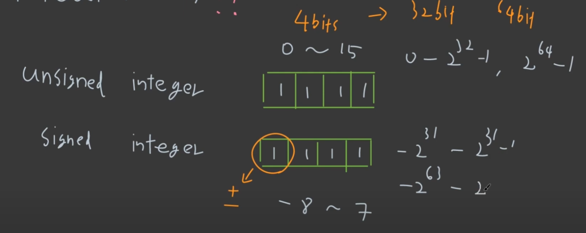
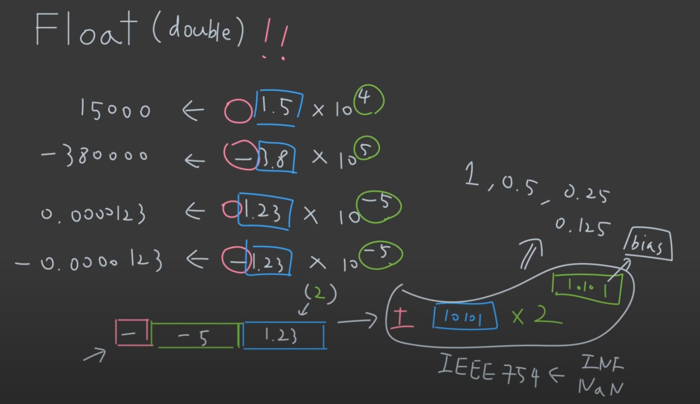
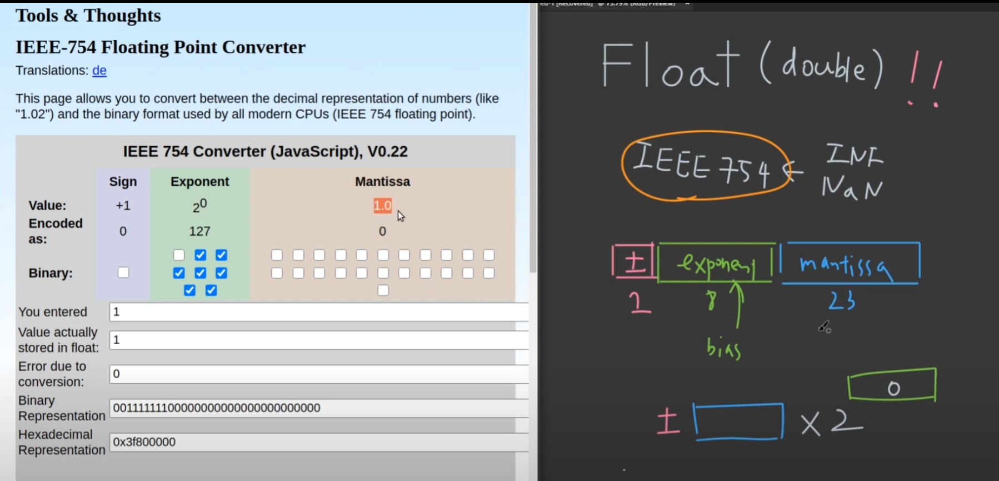
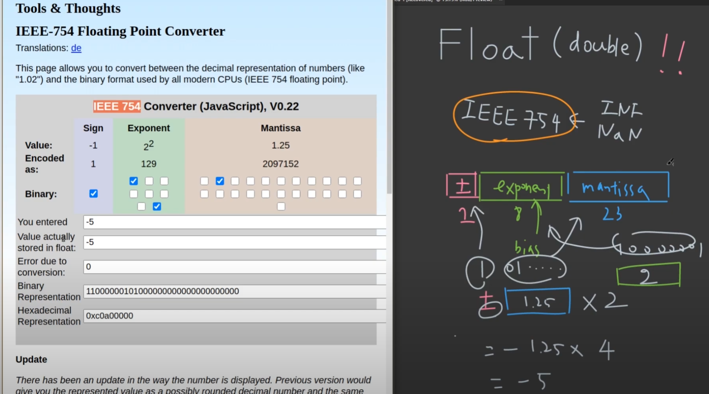
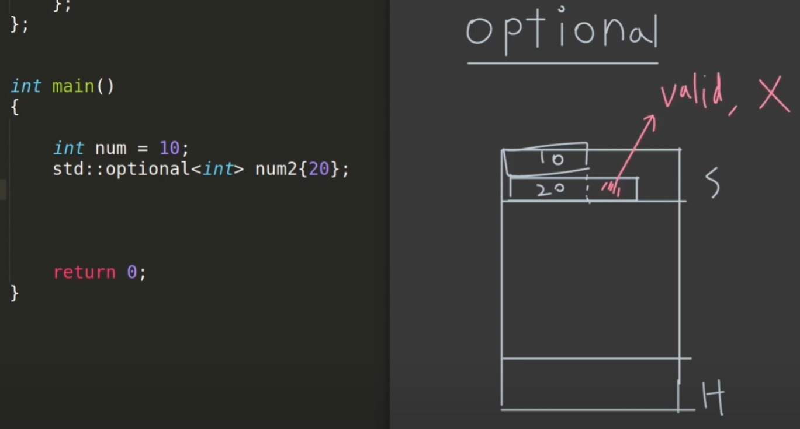
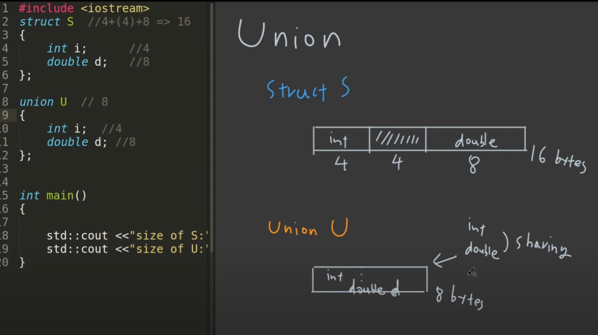
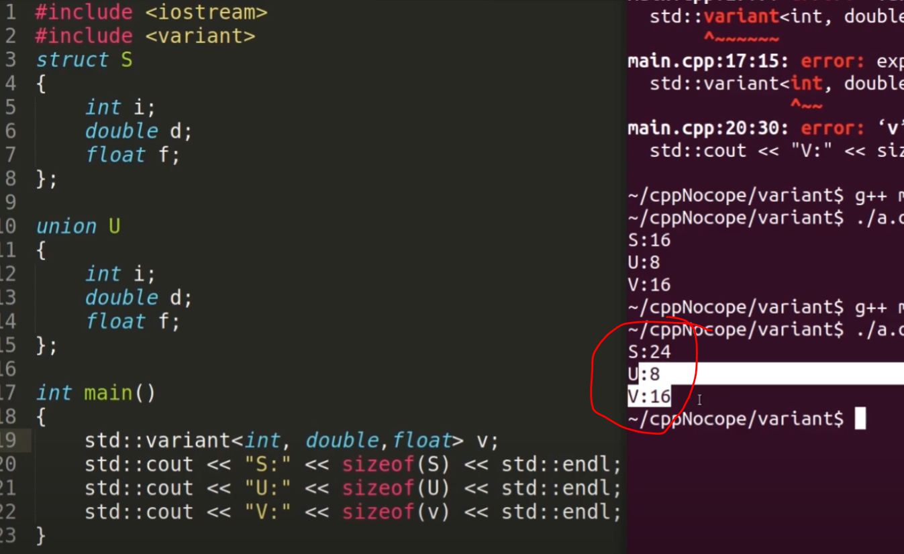
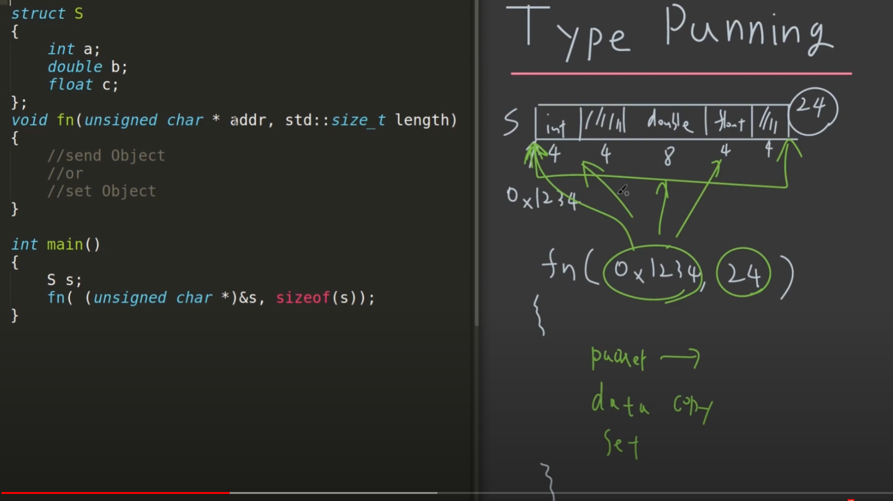

# 12 Types
> floating number, pair, tuple ...

## 1. floating number

### Integer


---
### Float, Double


---



- **INF**: exponent가 전부 1이고 mantissa가 **전부 0**
- **NAN**: exponent가 전부 1이고 mantissa가 **0이 아닌 어떤 정보**

---
- **Question**: 0.3f + 0.4f != 0.7f

---
## 2. pair, tuple

### pair, tuple 언제 사용하는가?
- project의 여러 곳에서 사용하는 상황이면 struct를 써서 공유하는게 좋지만, 한 file 내에서만 사용하는 경우 pair, tuple을 사용

---
### std::pair
> 추후

---
### std::tuple
- make_tuple 없이 {a,b,c} 이렇게 가능

- 일반적인 방법

```cpp
std::tuple<double, char, std::string> get_student()
{
    return std::make_tuple(3.8, 'A', "Lisa Simpson");
}

int main()
{
	const auto student0 = get_student();
    std::cout << "ID: 0, "
              << "GPA: " << std::get<0>(student0) << ", "
              << "grade: " << std::get<1>(student0) << ", "
              << "name: " << std::get<2>(student0) << '\n';
}
```

---
- using std::tie function

```cpp
std::tuple<double, char, std::string> get_student()
{
    return std::make_tuple(3.8, 'A', "Lisa Simpson");
}

int main()
{
    double gpa2;
    char grade2;
    std::string name2;
    std::tie(gpa2, grade2, name2) = get_student(2);
    std::cout << "ID: 2, "
              << "GPA: " << gpa2 << ", "
              << "grade: " << grade2 << ", "
              << "name: " << name2 << '\n';
}
```

---
- C++17 (1)

```cpp
std::tuple<double, char, std::string> get_student()
{
    return std::make_tuple(3.8, 'A', "Lisa Simpson");
}

int main()
{
    // C++17 structured binding:
    const auto [ gpa3, grade3, name3 ] = get_student();
    std::cout << "ID: 3, "
              << "GPA: " << gpa3 << ", "
              << "grade: " << grade3 << ", "
              << "name: " << name3 << '\n';
}
```

- C++17 (2)
```cpp
std::tuple<double, char, std::string> get_student()
{
    return std::make_tuple(3.8, 'A', "Lisa Simpson");
}

int main()
{
    // C++17 structured binding:
    const auto student0 = get_student();
    std::cout << "ID: 3, "
              << "GPA: " << get<0>(student0) << ", " // get<double>
              << "grade: " << get<1>(student0) << ", " // get<char>
              << "name: " << get<2>(student0) << '\n'; // get<std::string>
}
```

---
## 3. optional (C++17)

- 변수나 object가 있을 수도 있고, 없을 수도 있다.
> ?? 슈뢰딩거 ??

- error를 검출하는 방법에는 다음 2 가지가 존재한다.
	- (1) pair로 <var, error_code> 형식으로 return 하여 판단하는 방법
	- (2) optional

- 실제 메모리 맵에서의 구성은
	- optional은 실제 variable의 size 보다 더 크게 생성된다.
	- data를 저장하는 곳과 valid인지 아닌지를 판단하는 memory가 따로 구성된다.



- code

```cpp
#include<iostream>
#include<optional>

std::optional<int> opt_divide(int a, int b)
{
    if(b==0) return std::nullopt;
    else return a/b;
}

  

int main()
{
    const auto answer = opt_divide(10, 0);

    if(answer) std::cout << answer.value() << std::endl;
    else std::cout << "no value" << std::endl;

	// std::cout << answer.value_or(-1) << std::endl;
	
    return 0;
}
```

---
### object를 사용하는 방법

```cpp
#include<iostream>
#include<optional>

class Cat
{
public:
    void print()
    {
        std::cout<<"meow"<<n<<std::endl;
    };
private:
    int n=10;
};

int main()
{
    //in-place creation
    std::optional<Cat> cat{std::in_place}; // cat{Cat()} 이런식으로도 가능하지만, 이는 tmp cat을 만들고 move가 일어나서 효율적이지 않음. std::in_place 메모

    if(!cat) std::cout<< "no cat yet" << std::endl;
    else
    {
        std::cout<<"ready"<<std::endl;
        cat->print();
    }
}
```

---
## 4. enum class

- type에 값이 객관식으로 정해질 때, bug의 확률을 0으로 만드는 방법

---
### 예시

- string을 사용하면

```cpp
#include<iostream>
//red, blue, yellow | small, medium, large
void buyShirt(color, size)
{
    //1 string
    if(color="red")
    {
    }
    else if(color=="blue")
    {
    }
}

int main()
{
    buyShirt("redd", "mediumm");
    return 0;
}
```

위와 같이 사용하면 main에서 오타가 있는 상태로 입력이 되더라도 compile 정상적으로 되어지고, function 안에서 아무 동작이 일어나지 않는 버그가 발생한다.

- macro 사용

define 으로 RED를 사용하여 진행할 수 있지만, main에서 똑같은 변수명이 존재할 수 있는 확률이 존재한다.

- enum class (!)
	- class namespace를 사용하므로 절대적으로 버그를 막을 수 있다.
	- _**또한, operator를 따로 지정할 수 있다.**_

```cpp
#include<iostream>

enum class Csize{small, medium, large};
enum class Ccolor{red, blue, yellow};

Csize operator++(Csize& s)
{
    if(s==Csize::large) return s;
    s = static_cast<Csize>(static_cast<int>(s)+1) //!!!!!!!!!!!!!!!
    return s;
}

void buyShirt(Ccolor color, Csize size)
{
    if(color==Ccolor::red)
    {
    }
    else if(color==Ccolor::blue)
    {
    }
}

int main()
{
    buyShirt(Ccolor::red, CSize::small);
    return 0;
}
```

위에서 보면 중요한 것이

```cpp
s = static_cast<Csize>(static_cast<int>(s)+1) //!!!!!!!!!!!!!!!
return s;
```

operator를 이용해 바꾸는 방법인데, enum class의 _s_ 를 int로 _static casting_ 시킨 후 1을 더하고 다시 Csize enum class로 _static casting_ 을 취하면 옷이 하나 사이즈업 할 수 있다.

> 간지나므로 메모..

---
## 5. union
> Memory Saving을 목적

### 일단 이걸 언제 쓰냐?

- 잘 모르겠다.
- 굳이 어렵게 쓸 필요가 없을 것 같다.
- 위험하다.

> C++17 부터는 _union_ 을 보완하여 std::variant가 사용된다.

---

```cpp
#include<iostream>

struct S //16
{
    int i; //4 (+4)
    double d; // 8
};

union U // 8
{
    int i; // 4
    double d; //8
};

int main()
{
    std::cout<<sizeof(S)<<std::endl;
    std::cout<<sizeof(U)<<std::endl;
}
```



- 즉, _union_ 은 두 개의 type이 되어있더라도, memory map 상에서 공유하고 있으므로 경우에 맞게 사용되는 것이다.
- 한번에 하나의 type만 사용된다.

```cpp
union U // 8
{
    int i; // 4
    double d; //8
};

int main()
{
    U u;
    u.i =10;
    std::cout<<u.i<<std::endl;

    u.d = 0.3;
    std::cout<<u.d<<std::endl;
    std::cout<<u.i<<std::endl;
}
```

---
## 6. variant

### 이건 또 언제쓰냐?
- std::pair 대신에 std::variant로 value 또는 error_code를 예외처리 뱉어줄 때, **memory saving**

---
### 그래서 왜 쓴다고? _union_ 이 문제가 있어서, 왜?

- _union_ 의 문제점
	- _string, vector_ 등의 **destructor call**
	- _int, double_ 에서의 **undefined behavior**

_union_ 을 대체하는 것 뿐만 아니라 error code 검출을 위한 것

_optional_ (exception 없이 handling 하는 방법)이 아니라, pair로 <var, error_code>로 보내는 방법 중에서 pair 대신에 variant를 쓰면 practical하게 조금 더 saving 할 수 있다.

---
### Debugging



_variant_ 로 선언 된 메모리가 _union_ 에 비해 조금 더 큰 걸 보아 뭔가 다른 정보가 추가된 것을 알 수 있다.

---

- _variant_ 를 사용하면, 어떤 type을 사용하는지 tracking이 가능하다.
- 즉, _undefined behavior_ 에 접근 안됨

```cpp
	std::variant<int, double, float> v;
    v=10;
    if(auto pVal=std::get_if<double>(&v))
    {
        std::cout<<*pVal<<std::endl;
    }
    else
    {
        std::cout<<"v is not type double"<<std::endl; // throw error
	}
```

---
- _destructor_ 를 따로 부를 필요 없이 바로 다른 type을 넣어줘도 managing 해준다.

```cpp
std::variant<std::string, std::vector<int>> sv;

sv = std::string("janghun");
std::cout<<std::get<std::string>(sv)<<std::endl;
sv = std::vector{1,2,3};
```

> 오호...

---
## 7. Type Prunning

### 이게 뭔지? 언제, 왜 쓰는지?

내가 머리를 좀 굴려서 type을 바꿔서 조금 더 효율적인 연산이 필요할 때, _pointer casting_ 을 통해 구현한다.
> 아직까지 무슨 말인지 모르겠음

이때 _memcpy_ 를 사용하는데, 이 또한 C++20 부터는 bit_cast 함수가 구현되어 있다. 만약 C++20이 지원안되더라도 구현이 있으므로 copy해서 사용하자.

---
### C++ -> Pointer (Address)

- 어떤 type을 나타내고 있는 메모리 공간을 다른 type으로 읽어서 manipulating 한다.
- 포인터로 구현하면 몇 가지 type을 제외한 pointer casting은 undefined 되어있어서, 안될 수 있다. (unsinged char, char *, std::byte * 만 가능하다는 말)

---
- 즉, 이렇기 때문에 _memcpy_ 를 통해서 _pointer casting_ 을 해야함.
- C++20 부터는 std::bit_cast를 사용




*[HTML]: HyperText Markup Language
*[CSS]: Cascading Style Sheets
*[JS]: JavaScript