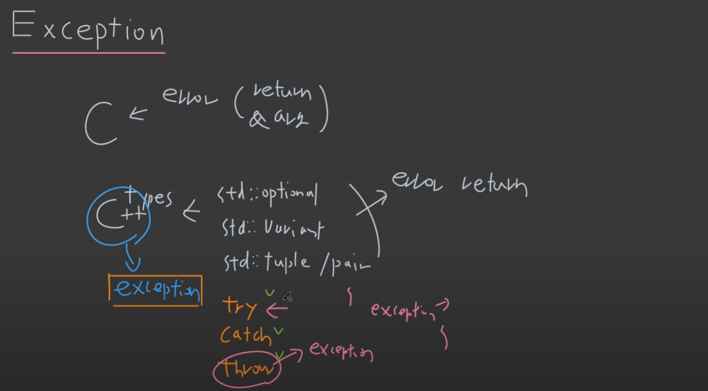

# 13 Exception
> exception, stack unwinding, safety guarantees

## 1. exception


### Rule
- throw로 던질 때는 **R-Value**
- catch로 받을 때는 **Reference**

```cpp
#include<iostream>

int divide(int a, int b)
{
    if(b==0)
    {
        throw std::runtime_error("divide by 0"); // r-value
    }
    return a/b;
};

int main()
{
    try
    {
        std::cout<<divide(10,0)<<std::endl;
    }
    catch(std::exception &e) // reference, const도 가능
    {
	    std::cout<< e.what() <<std::endl;
        std::cout<<"exception catched" << std::endl;
    }
}
```

- 위에 exception을 throw 할 때, _std::exception_ 이라는 object가 heap에 생성된다.

- 각각의 exception은 cppreference 참고
> https://en.cppreference.com/w/cpp/error/exception

---
### 정리

- throw 자체가 object를 던지는 것이기 때문에 error object 말고 진짜 object를 던지는 것도 가능함.

```cpp
throw Cat();
catch(const Cat& c) {} ;
```

- 하지만, 목적 자체가 error handling 이기 때문에 절대 사용 X

---
```cpp
catch(...)
```

- 위와 같이 된 것은 모든 exception을 받는 것이다.

---
## 2. stack unwinding

### throw 랑 return의 process map의 차이

```cpp
#include<iostream>
#include<exception>

int divide(int a, int b)
{
    if(b==0) throw std::runtime_error("divide by 0");
    else return a/b;
};

void f()
{
    std::cout<<divide(10,0)<<std::endl;
}

int main()
{
    try
    {
        f();
        //std::cout<<divide(10,0)<<std::endl;
    }
    catch(std::exception &e)
    {
        std::cout<<e.what()<<std::endl;
    }
}
```

- 위와 같은 상황에서, _stack frame_이 올라가는 순서가 
  - _main()_ -> _f()_ -> _divide()_ 순으로 진행되고,
  - _devide()_ 에서 _exception_ 이 발생한다.
  - 이때, _stack frame_ 이 역순으로 pop이 되는데 이러한 과정을 **stack unwinding_ 이라고 한다. (unwind: 긴장을 풀다, 풀다)

- 근데 만약 _main()_ 에서도 _catch_ 가 없이 그냥 끝나버리면, _terminate_가 되버리고 이 경우 _program_ 은 _catch_를 찾을 때 까지 계속 진행된다.

---
### 그래서 왜 쓰냐고.

- _return_ 으로 이러한 '예외'를 처리하려고 하면 매번 '하위함수' 에서 '상위함수'로 _return_ 을 하면서 값을 넘겨줘야 하는데, 이 경우 _process map_ 에서 볼 수 있듯이, 매번 넘겨주는게 복잡하다.
- 하지만, _exception_ 을 쓰면, object를 생성하므로, _return_ 필요없이 _stack unwinding_ 을 사용함으로써, 이러한 예외처리를 할 수 있다.

---
## 쓴다고 performance 차이가 있는가?

- path: overhead가 거의 없다.
- throw: overhead가 크냐? 아니냐?
  - for loop 같은 곳에서는 쓰지마라
  - profiling을 해보고 차이가 나는지 확인하라

---
### new/delete <-> exception 사이 memory leak..... 을 고민할빠에야 그냥 smart pointer 써라.

- _new/delete_ 와 _exception_ 사이에서 _memory leak_ 이 발생할 수 있다.
  - 왜냐하면, _exception_ 이 발생하면 _catch_ 를 찾으러 _stack unwinding_ 을 시작하여 _delete_ 를 찾지않아 발생가능하다.

- 그 냥 SMART POINTER !!!!!
  - 즉, _exception safety_ 를 보장해야한다.

---
## 3. exception safety

### Safe Guarantees
- Basic Exception Safety
- Strong Exception Safety
- No-throw Guarantees
- No Exception Safety

> resource leak이 발생할 수 있다.

---
### No Exception Safety

```cpp
void f()
{
	Cat *cp = new Cat();
	divide(10,0);
	delete cp;
};

int main()
{
	try
	{
		f();
	}
	catch(const std::exception &e)
	{
		std::cout<<e.what()<<std::endl;
	}
}
```

위의 경우 처럼, _smart pointer_ 를 쓰지 않고, 그냥 _new/delete_ 를 사용할 시, _stack unwinding_ 으로 인해, _delete_ 를 수행하지 않고 종료

---
### Basic Exception Safety

- **Resource Leak**: X
- **State Change**: O

Resource Leak은 없지만, Exception이 던져졌을 때, 프로그램의 상태가 바뀔 수 있다 (?)
> 프로그램의 상태?.. 흠

전역변수를 선언해놓고, 어떤 error가 나올 수 있는 함수 내에서 state를 바꾸면, resource leak은 발생하지 않지만, state는 바뀔 수 있다.

---
### Strong Exception Safety

- **Resource Leak**: X
- **State Change**: X

_exception_ 이 던져질 수 있는 _function call_ 부분 밑으로 _state change_ 가 되는 line을 내리면 된다.

```cpp
g=0; 

void f()
{
	g=0; //basic
	int a = divide(10,1); // local로 선언하면 strong
	divide(10,0); 
	g=1; // strong
}
```

> 여기서 다시 되짚고 가자.. 모든 건 _stack frame_ 을 기준으로 _process map_ 을 머릿 속으로 상상하고 구현하자.. 모든 _Memory Map_ 은 _stack, heap, static_ 공간을 상상하며 _data_ 의 크기에 따라 생각하고 구현하자.

---
### No-Throw Guarantees

_exception throw_ 와 _try, catch_ 를 바로 연결되어 있는 상/하위 _function_ 에서 진행하면 된다.


---
## 4. Usage

### 그럼 언제 쓰냐고.

- ex) _constructor_ -> _exception_, 왜? _return type_ 이 없어
  - _constructor_ 안에서는 _internal handling_ 이 안됨.

---
### 잘못쓰는 경우
- _nullptr, out of range_ 는 버그가 아니라, 개발자의 잘못
- 절대 일어나지 않을 일을 _exception_

---
### 대표적으로 사용하는 경우

- _packet_ 의 불안정
- _file system_ 의 존재

> 선택의 문제

---

### 기업별 C++ Style 가이드

- 구글은 _exception_ 을 사용 X, 이유는?
  - _safety guarantees_ 를 체크해야한다. 최소 basic
  - _compile time_ 증가
  - _readability_ 감소
  - _exception_ 을 쓸 필요가 없어도 남용한다.

*[HTML]: HyperText Markup Language
*[CSS]: Cascading Style Sheets
*[JS]: JavaScript